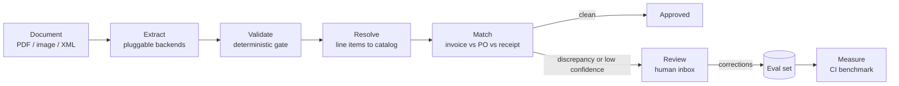

# docmatch

**Document reconciliation engine.** docmatch extracts invoices and receipts with vision language models, validates them with deterministic gates, matches them against purchase orders and receiving records, routes exceptions to human review, and measures every change against a labeled benchmark in CI.

> **Status:** phase 0 is done: its number is in the Benchmarks section with the commit that produced it. Phase 1, extraction, is next. The remaining tables fill in as phases complete, and a phase is not done until its number is here.

## Why

Accounts-payable teams still receive most invoices as PDFs, scans, and phone photos. Turning those into ledger entries is three separate problems that most tools blur together:

1. **Extraction.** Reading header fields and line items out of noisy documents.
2. **Reconciliation.** Checking what was invoiced against what was ordered and what was received, the classic three-way match, and explaining every discrepancy.
3. **Trust.** Deciding per document whether to auto-approve or send to a human, and knowing when a prompt, model, or threshold change made things worse.

Most public projects stop at problem 1 with a single model call. docmatch treats problem 1 as a replaceable backend and puts the engineering into problems 2 and 3.

## What docmatch is not

- **Not an OCR wrapper.** Extraction backends are pluggable and benchmarked against each other. None of them is the product.
- **Not an autonomous agent.** The pipeline is an explicit state machine. Models structure text; deterministic code does the arithmetic and makes the decisions.
- **Not a SaaS.** No accounts, billing, or tenancy. One CLI, one API, one review page.

## Architecture



Every stage records cost and latency to a tracing backend, and every stage has an eval that runs in CI.

## Phases

Phases have exit criteria, not dates. Each phase produces a number that goes into the Benchmarks section. The next phase does not start until that number exists.

### Phase 0. Harness

Measurement before modeling.

- Loader for the DocILE dataset. Access is a request form that returns a download token; the data is never committed, only the loader and the results.
- Ground-truth normalization: currency, dates, numeric formats, whitespace.
- Metrics module: field-level precision, recall, and F1 with normalization; line-item scoring by optimal assignment between predicted and labeled rows, with per-cell accuracy.
- Fixed evaluation subset with a pinned manifest so numbers are comparable across commits.
- pytest suite and a CI job that runs the eval on the fixed subset.
- Baseline run with one cheap vision model.

**The number:** baseline field F1 and line-item F1 on the fixed subset.
**Exit:** CI is green and the Benchmarks section has one row.

### Phase 1. Extraction

- Pydantic schemas where absence is explicit rather than guessed. A confidence rides beside each value only where a backend returns one natively; no model is asked to grade itself.
- An `Extractor` interface with several backends: a cheap vision model, a second provider, a commercial prebuilt invoice model, an OCR-then-LLM path, and a local open-weight document model. See Extraction backends.
- Image preprocessing: orientation from metadata, downscale to a fixed long edge, no grayscale.
- Deterministic validation gate: totals agree and dates are sane. Only rules the labels themselves pass belong in it; line-total reconciliation, tax arithmetic, and identifier checksums fail too often on the labels or apply to almost no documents. Confidence never gates acceptance on its own.
- Bounded retries with per-document cost accounting.

**The number:** a backend comparison table with field F1, line-item F1, gate pass rate, cost per document, and p50/p95 latency. A calibration table showing accuracy by confidence bucket. A gate ablation showing what the gate catches that confidence does not.
**Exit:** at least three backends in the table.

### Phase 2. Matching

- Generator that derives purchase orders and receiving records from the labeled invoices and injects labeled discrepancies: price variance, quantity short-ship and over-ship, missing line, extra line, unit-of-measure variant, tax mismatch, duplicate invoice, rounding drift.
- Rules engine with configurable tolerances and a discrepancy taxonomy with severities.
- Explainable results: which rule fired, on which numbers, with the tolerance applied.

**The number:** discrepancy detection precision and recall per type, and the false-positive rate on clean cases. An end-to-end row, image to match result, showing compound error.
**Exit:** per-type table plus the end-to-end row.

### Phase 3. Entity resolution

- Synthetic product catalog with SKUs, canonical descriptions, and noisy variants derived from labeled line items.
- Postgres with `pgvector` and `pg_trgm`. Hybrid retrieval with reciprocal rank fusion.
- Cross-encoder reranking as an ablation, kept or dropped based on the number.
- Resolution confidence feeds the review routing.

**The number:** top-1 and top-5 accuracy for trigram only, vector only, hybrid, and hybrid plus rerank, with latency per query.
**Exit:** the table, and a documented keep-or-drop decision on the reranker.

### Phase 4. Pipeline, review, observability

- Explicit status state machine in Postgres: received, extracted, validated, resolved, matched, needs_review, approved, rejected.
- Postgres-backed worker with idempotent handlers under at-least-once delivery.
- HTTP API in front of the engine.
- Tracing with cost and latency per stage.
- Review inbox: document viewer, extracted fields with confidence, discrepancy list, approve or correct. Corrections are appended to the eval set as new cases.
- A written decision on whether a graph orchestration library earns its place for pause-and-resume, or why plain code is enough.

**The number:** end-to-end p95 latency and cost per document; review rate as a function of gate strictness; a CI regression gate that fails when F1 drops beyond a threshold.
**Exit:** the full loop works from upload to approval on the fixed subset.

### Phase 5. Packaging

- Final benchmark tables, ablations, and a failure analysis of the top error classes.
- Reproducible eval entry point so anyone can regenerate a row.
- Short demo recording focused on reliability, not UI.

**The number:** this README.
**Exit:** a reader unfamiliar with the project can reproduce one benchmark row from a clean checkout.

### Phase 6. Regional adapters

The core is region-neutral. Adapters plug into three seams: `SourceAdapter` for ingestion, `RulesAdapter` for fiscal validation, and `ExportAdapter` for reporting formats.

First target, Dominican Republic:

- Structured e-invoice ingestion, e-CF XML, types E31, E32, E41, E43 first.
- Paper comprobantes through the same extraction seam.
- Checksum and registry validation for RNC and NCF identifiers.
- Fiscal rules: ITBIS 18%, ISR retention on services 15%, legal tip 10%.
- Pipe-delimited 606 purchase report export.
- A private regional benchmark that is never committed.

**The number:** field F1 on the private regional set, and a 606 export that passes the tax authority's pre-validator.

### Stretch

- Expose `extract`, `match`, and `explain` as an MCP server.

## Benchmarks

Filled in as phases complete. Every row names the commit that produced it.

### Extraction, fixed subset

| Backend | Field F1 | Line-item F1 | Gate pass rate | Cost / doc | p50 / p95 latency | Commit |
|---|---|---|---|---|---|---|
| `gemini-3.1-flash-lite`, pages at 1600 px | 0.615 | 0.374 | phase 1 | $0.00203 | 5.2 s / 9.3 s | [`28d0738`](https://github.com/franklinmdev/docmatch/commit/28d0738) |

The two commands that produced the row, with DocILE's labels in `data/docile`
and the pinned public copies in `data/ucsf`:

```bash
uv run --env-file .env docmatch extract --out data/runs/gemini
uv run docmatch eval --predictions data/runs/gemini/predictions.json
```

All 100 pinned documents were read, every one on its first attempt, and none
failed, so both numbers are over the whole subset. The run cost $0.20 and took
144,353 input and 111,507 output tokens. There is no gate pass rate yet because
there is no gate: the deterministic validation gate is phase 1, and the column
is here so that the row it belongs to already exists.

**Why this row replaced the Phase 0 one.** The subset moved. The Phase 0 row
was measured on 100 val documents whose pages the backend read from DocILE's
own copies, and DocILE's terms bar third-party access to those copies, which a
hosted model is. The subset is now 100 val UCSF documents read from the public
copies the UCSF Industry Documents Library publishes (see
[The fixed subset](#the-fixed-subset)), so the two rows are over different
documents and this one does not measure an improvement over the other. The old
row, field F1 0.515 and line-item F1 0.101, stays reachable at
[`65916b4`](https://github.com/franklinmdev/docmatch/blob/65916b4/README.md#benchmarks).

**What the two numbers mean.** Field F1 is over normalized header values, one
fieldtype at a time. Line-item F1 is over whole rows, and it is much harsher
than it looks next to the per-cell accuracies in the same report:
`line_item_amount_gross` is read correctly in 74.5% of labeled cells,
`line_item_quantity` in 69.8% and `line_item_description` in 64.5%, but a row
counts as correct only when every one of its cells matches and it carries no
cell the label does not. A row with four right cells and one wrong one scores
zero. That is deliberate, and `engine/src/docmatch/metrics/line_items.py`
argues for it; the per-cell table is where partial credit lives.

**Where this baseline loses.** Header recall is 0.590 against precision 0.641,
so the model more often fails to find a value than invents one, and the
weakness is concentrated in the address fields: `customer_billing_address` is
0.130 and `vendor_address` 0.262, and between them they carry 183 of the 472
missed header values and 146 of the 381 spurious ones, which is what asking for
every distinct value of a repeated field costs before any prompt work.
`date_issue` at 0.959 and `date_due` at 0.919 are what the same model does on a
field with one unambiguous form. None of that is tuned: this is one prompt, one
resolution and no retries on content, which is what a floor is supposed to be.

**Currency, as read and derived.** Field F1 counts the value code derives for
`currency_code_amount_due` beside what the model read. As read, the field is
0.062: the model left it empty on 60 of the 62 documents that label it, a
recall miss and not a format one, since the scorer already reads `$` as USD.
With the symbol code takes from `amount_due` and `amount_total_gross`, it is
0.889, with 52 matched, 10 missing and 3 spurious.

### Matching, injected discrepancies

| Discrepancy type | Precision | Recall | Commit |
|---|---|---|---|
| | | | |

### Entity resolution

| Method | Top-1 | Top-5 | Latency / query | Commit |
|---|---|---|---|---|
| | | | | |

### End to end

| Stage | p95 latency | Cost / doc | Review rate | Commit |
|---|---|---|---|---|
| | | | | |

## Data

- **Real invoices:** DocILE, 6,680 real annotated invoices with key-field and line-item labels, plus 100k synthetic and close to 1M unlabeled documents. Access is a request form that returns a download token. The terms are non-commercial research use only, no redistribution, no third-party access, GDPR compliance, and deletion when the permission ends. They restrict the data, not the publication of results, so the numbers in this README are publishable and the documents are not.
- **Purchase orders, receiving records, catalog:** generated from the labels with controlled, labeled perturbations, so every discrepancy case has an exact expected answer. The generator and its seed are committed; the outputs are reproducible.
- **Regional private sets:** real documents with personal data. Never committed. Only aggregate numbers appear in this README.
- **Corrections from review:** appended to the eval set as new cases, forming the data flywheel.

**Getting DocILE.** Request a token at https://docile.rossum.ai/. The form returns it immediately; there is no approval wait. Put it in `.env` as `DOCILE_TOKEN` (see `.env.example`), then download the annotated subset, 1.14 GB, into the gitignored `data/`:

```bash
curl -O "https://docile-dataset-rossum.s3.eu-west-1.amazonaws.com/$DOCILE_TOKEN/annotated-trainval.zip"
```

Upstream's `download_dataset.sh` does the same thing. Note that its `--help` names this subset `labeled-trainval`, which 404s; `annotated-trainval` is the working name.

## Running the engine

From a clean checkout, with [uv](https://docs.astral.sh/uv/) installed:

```bash
uv sync            # create the virtualenv, install the engine and its dev tools
uv run ruff check  # lint
uv run mypy        # typecheck, strict, with the pydantic plugin
uv run pytest      # tests; these need no dataset and are what CI runs
```

### One document

With DocILE downloaded into `data/docile`, print the labels the dataset holds
for one document, its KILE header fields and its LIR line items:

```bash
uv run docmatch show <document-id>
```

Document ids are the entries of `data/docile/trainval.json`. Pass `--data-dir`,
or set `DOCMATCH_DATA_DIR`, to read a dataset kept outside the repository.

Score a predicted document against those labels. A prediction carries the KILE
header fields under `fields` and the LIR line items under `line_items`, one
object per row. In either, a fieldtype carries one value, a list of values, or
`null` for a field the document does not have:

```json
{
  "fields": {
    "vendor_name": "Synthetic Supplies Ltd",
    "date_issue": "March 4, 2026",
    "amount_due": "US$ 503,70",
    "tax_detail_rate": ["8.25%", "5%"],
    "date_due": null
  },
  "line_items": [
    {
      "line_item_description": "Blue widget",
      "line_item_quantity": "2",
      "line_item_amount_gross": "100.00"
    },
    {
      "line_item_description": "Red widget",
      "line_item_quantity": "1",
      "line_item_amount_gross": "403.70"
    }
  ]
}
```

```bash
uv run docmatch score <document-id> --prediction prediction.json
```

The command reports two numbers. The field score is precision, recall, and F1
over header values, then every fieldtype and whether each of its values
matched, was missed, or was spurious. The line-item score is precision,
recall, and F1 over whole rows, then per-cell accuracy for every LIR
fieldtype.

Rows are paired by the assignment that agrees on the most cells, never by
position, so predicting the table in a different order costs nothing. A row
counts as correct only when every one of its cells matches and it carries no
cell the label does not; partial credit lives in the per-cell accuracy, where
it can be read as what it is. Both decisions, and the numbers behind them, are
documented in `engine/src/docmatch/metrics/line_items.py`.

Both sides are normalized before anything is compared, so `US$ 503,70`,
`$503.70`, and `503.7` are one amount and `March 4, 2026` and `3/4/2026` are
one day. A line item's cells take the same rules as a header field. The rules,
and the measurements behind them, are documented in
`engine/src/docmatch/metrics/normalization.py`. The values above are made up:
DocILE may not be redistributed, so no label text is committed anywhere in this
repository.

### The fixed subset

Every number in the Benchmarks section is measured over the same 100 documents, pinned as a list in `engine/src/docmatch/evals/subset.json`.

**Pool.** The val split's documents whose DocILE source is UCSF, 225 of its
500. Hosted backends read each document's public copy, the PDF the UCSF
Industry Documents Library publishes, because DocILE's terms bar third-party
access to DocILE's own copies. FCC documents are left out: nothing DocILE
records resolves them to a file.

**Ranking.** Each id is ranked by `sha256("<seed>:<id>")` with seed 20260912,
lowest first. Restricting the pool kept every UCSF document of the earlier
whole-split draw, and a prefix of the list is still a sample of the same draw.

**Admission.** The ranking is walked in order, and a document is admitted only
when its public copy has DocILE's page count and every page has DocILE's shape:
one scale puts both sides within 1 px of DocILE's size at 200 dpi, measured
with the page's rotation applied. Labels come from DocILE, so a copy with an
extra page or a different page would score the backend against pages it never
saw. A page the archive declares at another scale with the same aspect ratio is
admitted, because labels are boxes relative to the page; a fixed 200 dpi
comparison rejected 47 documents for that alone. The walk stops at 100 admitted
documents; when fewer pass, the subset is every admitted document. The walk
that pinned the current manifest (`uv run docmatch subset --write`, commit
`9bcf002`) read 105 copies and admitted 100; all 5 rejects carry a page
DocILE's copy does not. 39 of the 43 UCSF documents in the earlier whole-split
draw are still pinned, and the other 4 are among those rejects.

**Rejects and digests.** The manifest pins every rejected id with its reason
(`page count differs`, `page size differs`, `fetch failed`) and the sha256 of
every admitted public copy. Ids and digests carry no document content. Check,
offline, that the ranking minus the rejects still draws the pinned list:

```bash
uv run docmatch subset
```

It needs DocILE's metadata in `data/docile` and no network, and exits non-zero
when the pinned list is no longer what the ranking minus the rejects draws.
`--write` walks the ranking again, fetching every copy from the archive, and
rewrites the manifest; changing the seed is a deliberate change of benchmark
rather than a detail.

**Public copies.** Download the pinned copies into the gitignored `data/ucsf`,
each checked against its digest:

```bash
uv run docmatch download
```

A copy already there with the pinned digest is kept. A copy the archive serves
with any other digest is not written and the command exits non-zero, so a file
that changed in the archive stops the benchmark instead of quietly moving it.
The download route is the one the library's own web app uses, undocumented, so
it may change without notice.

Score a run of predictions over the subset. The predictions file is a JSON
object keyed by document id, each value the single-document shape above:

```json
{
  "0a1b2c3d4e5f60718293a4b5": {"fields": {}, "line_items": []},
  "6c7d8e9f0a1b2c3d4e5f6071": {"fields": {}, "line_items": []}
}
```

```bash
uv run docmatch eval --predictions predictions.json
```

From a checkout with DocILE in `data/docile`, that is the command the numbers
in the Benchmarks section come from. It prints field F1 and line-item F1 over
the whole subset, a per-fieldtype breakdown of each, the currency field both
as read and with the value code derives for it, and the ids behind two
counts that are not scores: pinned documents the run did not predict, and
predicted documents the subset does not pin.

Both numbers are micro-averaged, summing counts across documents rather than
averaging each document's F1, so a one-row table does not weigh as much as a
thirty-row one. A pinned document missing from the predictions file is scored
as a prediction of nothing rather than skipped, because a number over 97 of the
100 documents is not comparable with one over 100.

The report carries counts and no label text, so it can be pasted into a commit
message or an issue. CI runs the same command on a committed synthetic corpus
in DocILE's shape, `engine/tests/evals/synthetic`, which exercises the whole
path on every push while the dataset stays on the machine that downloaded it.

### The baseline run

`docmatch eval` scores a predictions file. `docmatch extract` is what produces
one: it hands every pinned document's public copy to one backend, which
prepares its own input (Gemini renders the pages) and fills in a schema built
from DocILE's own fieldtype names, and it writes the predictions beside a
record of what each document cost.

It reads the public copies `docmatch download` put in `data/ucsf` (`--copies`
points elsewhere), and before the first request it checks every pinned copy
against its digest. A missing or changed copy ends the run with one message
naming it, and nothing is sent.

```bash
uv run --env-file .env docmatch extract --out data/runs/baseline
```

It needs a `GEMINI_API_KEY` in `.env`, beside `DOCILE_TOKEN` (see
`.env.example`). Nothing in the engine reads `.env` by itself, which is what
`--env-file` is for; exporting the key into the shell works just as well. The
run is local and it costs money, which is the reason the two halves are
separate commands: a number can be re-derived from a saved run as often as it
is questioned without paying for the reading again.

Three files land in the `--out` directory, all under the gitignored `data/`:
`predictions.json`, which is the input to `docmatch eval`; `manifest.json`, the
subset this run actually covered; and `run.json`, which carries per-document
pages, attempts, tokens, cost, latency and any failure. So a benchmark row is
reproduced by

```bash
uv run --env-file .env docmatch extract --out data/runs/baseline
uv run docmatch eval --predictions data/runs/baseline/predictions.json
```

`--model` chooses the backend, `--long-edge` the pixels on a rendered page's
longer side for a backend that renders pages, `--attempts` and `--cost-cap`
bound what one document may spend before it is given up on, and `--limit` reads
only the first few pinned documents, which is how to check that a run works
before paying for all of them.

A `--limit` run has to be scored against the subset it covered, which is what
the `manifest.json` beside its predictions is for:

```bash
uv run --env-file .env docmatch extract --out data/runs/check --limit 5
uv run docmatch eval \
  --predictions data/runs/check/predictions.json \
  --manifest data/runs/check/manifest.json
```

Without the second flag the five predictions are scored against all 100 pinned
documents and the ninety-five never attempted are reported as recall the
backend lost.

A document that never produced an answer is left out of the predictions file
rather than written down as empty. `docmatch eval` scores a pinned document with
no prediction as a prediction of nothing and lists its id, so a failure costs
recall instead of quietly shrinking the denominator, and the two reports name
the same documents from two directions.

Absence is explicit on the way in as well. The schema asks for every value a
header field carries and one value per line-item cell, and a field the document
does not show is an empty list rather than a guess. A single value per header
fieldtype would have capped recall at 94.4% before any model read anything: 292
of the val split's 5,234 distinct header values are the second or later value of
their fieldtype in the same document, and a quarter of all documents print more
than one distinct `vendor_address`.

### The counts behind the rules

Several rules in `engine/src/docmatch/metrics` were decided by measurement
rather than by assumption: which way an ambiguous numeric date reads, what a
lone dot means, whether a fieldtype labeled twice carries one value or two.
Each of those numbers is written in the docstring beside the rule it justifies,
and one command recomputes all of them:

```bash
uv run docmatch corpus
```

It prints what the annotated set holds, what share of every fieldtype the rules
can read, and then each count under the module whose docstring asserts it, so
the report and the docstrings can be read side by side. Counts, shares and
fieldtype names only, no label text, so the report can be pasted into an issue
the way the eval report can.

It is a survey and not a second eval: it scores nothing and pins nothing. With
no dataset on the machine it prints one line and exits zero, because a survey
that cannot be taken is not a failure of the engine. `--split` counts over one
split; the default is `trainval`, the whole annotated set.

### Comparability

Neither score is comparable with the DocILE leaderboard, which matches a
prediction to a label by the overlap of their bounding boxes. The backends this
engine benchmarks return text and no boxes, so the scores here are over
normalized text; what has to stay comparable is this repository's own numbers
across commits.

## Extraction backends

The `Extractor` interface is the seam. Backends are compared, not chosen up front. Prices below are the vendors' own published list prices, each re-read from the vendor's pricing page on the date in the last column.

| Backend | Kind | List price | Role in the benchmark | Price read |
|---|---|---|---|---|
| `gemini-3.1-flash-lite` with structured output | vision LLM | $0.25 input, $1.50 output per million tokens, free tier available | cheap default, the baseline row | 2026-09-14 |
| `gemini-2.5-flash-lite` with structured output | vision LLM | $0.10 input, $0.40 output per million tokens, free tier available | cheaper, and unusable here: see below | 2026-09-14 |
| `gpt-5-nano` or `gpt-4o-mini` with structured output | vision LLM | $0.05 and $0.15 input, $0.40 and $0.60 output per million tokens | second provider | 2026-09-14 |
| Claude Haiku 4.5 or Sonnet 5 with structured output | vision LLM | $1 and $2 input, $5 and $10 output per million tokens | second provider | 2026-09-08 |
| Azure Document Intelligence prebuilt-invoice | specialized document model | $10 per 1,000 pages, 500 pages per month free | commercial baseline | 2026-09-07 |
| Google Document AI invoice parser | specialized document model | $0.10 per document of up to 10 pages, so $100 per 1,000 one-page invoices | commercial baseline, optional | 2026-09-14 |
| Cloud Vision document OCR, then an LLM over the text | OCR-first | $1.50 per 1,000 pages, first 1,000 per month free | ablation: what layout loss costs | 2026-09-08 |
| Docling with granite-docling-258M, local | open-weight document model | free, CPU | open-source baseline, strong on PDF tables | 2026-09-07 |

`gemini-2.5-flash-lite` is the cheapest of these and is not the one the baseline row uses. On the current Interactions API it ignores `response_format` and answers in prose, or in bounding boxes; only the 3.x Flash-Lite models honour a schema there. It does obey one on the `generate_content` path the vendor documents as legacy. Both were measured on 2026-09-14 with the same two-field schema, and the difference over a hundred documents is cents, so the engine takes the model that works on the API new code is meant to use. The row stays in the table because the next reader will ask the same question.

A list price is not a cost per document, and for the vision models it is not even close to one. A page becomes a number of tokens that the vendor decides: Gemini charges 258 tokens per 768 by 768 tile of the rendered page, so what this engine pays per document follows from the resolution it renders at, and two providers turn the same page into different numbers of tokens. The specialized models are billed per document or per page and have no such knob. That is why cost per document is a measured column of the benchmark rather than a figure quoted from a pricing page, and why the two kinds of backend cannot be ranked by list price alone.

## Stack

| Layer | Choice | Why |
|---|---|---|
| Engine | Python 3.12, `uv`, Pydantic | The language of the ecosystem the engine talks to. |
| Structured output | Provider-native constrained decoding, Pydantic schemas | Every major provider guarantees schema conformance; no DSL needed. |
| Storage and retrieval | Postgres, `pgvector`, `pg_trgm` | One ACID store for records, vectors, and fuzzy text. Trigram similarity fits short SKU strings; it is not BM25 and is not called that here. |
| Queue | Postgres-backed worker | No second datastore for a single-node system. |
| API | FastAPI | Thin, typed, boring. |
| Tracing | Langfuse | Open source, self-hostable, per-stage cost and latency. |
| Evals | pytest plus a metrics module, `scipy` for the row assignment | Ground-truth extraction needs field-level and assignment metrics, not judge models. Pairing predicted line items to labeled ones is the rectangular assignment problem, which is a solved one. |
| Review UI | Next.js, TypeScript | One page, timeboxed. |

Deliberately cut: schema DSLs, document-parsing SaaS as a foundation, Celery and Redis, judge-model eval frameworks, graph orchestration until phase 4 proves the need.

## Definition of done

A phase is done when its number is in this README with the commit that produced it, the eval that produced it runs in CI, and the next phase can start from a clean checkout.

## Repository layout

```text
docmatch/
  pyproject.toml       uv workspace root: dev tooling, lint, typecheck, test config
  uv.lock              pinned for every machine and for CI
  engine/              the Python engine, a uv workspace member
    pyproject.toml     the docmatch package and its `docmatch` command
    src/docmatch/      extraction, validation, resolution, matching, metrics
      evals/           the pinned subset, the run that scores it, the corpus survey
    tests/evals/       the synthetic corpus CI runs the eval on
  apps/review/         Next.js review inbox, from phase 4
  data/                ignored: datasets, generated fixtures, private sets
  docs/                decision records
  .github/workflows/   CI: ruff, mypy and pytest on every push
```

Tests live next to the code they test, so `src/docmatch/docile/dataset.py` is
tested by `src/docmatch/docile/test_dataset.py`. The eval suite lives under
`engine/tests/evals`: the corpus the eval command runs on in CI, with no test
of its own, since the command is the test.

## Contributing

Early days. Open an issue before a pull request so the phase plan stays intact.

## License

Apache-2.0. See [LICENSE](LICENSE).
