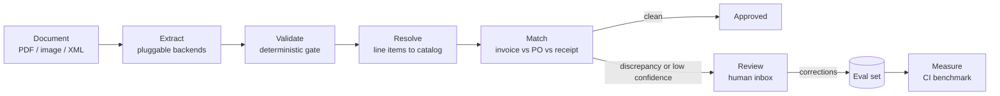

# docmatch

**Document reconciliation engine.** docmatch extracts invoices and receipts with vision language models, validates them with deterministic gates, matches them against purchase orders and receiving records, routes exceptions to human review, and measures every change against a labeled benchmark in CI.

> **Status:** phases 0 to 3 are done: their numbers are in the Benchmarks section with the commits that produced them, three extraction rows, the calibration table, the gate ablation, the matching table and its end-to-end rows, and the entity resolution table with the verdict on the reranker. Phase 4, the pipeline, review and observability, is next. The remaining tables fill in as phases complete, and a phase is not done until its number is here.

## Why

Accounts-payable teams still receive most invoices as PDFs, scans, and phone photos. Turning those into ledger entries is three separate problems that most tools blur together:

1. **Extraction.** Reading header fields and line items out of noisy documents.
2. **Reconciliation.** Checking what was invoiced against what was ordered and what was received, the classic three-way match, and explaining every discrepancy.
3. **Trust.** Deciding per document whether to auto-approve or send to a human, and knowing when a prompt, model, or threshold change made things worse.

Most public projects stop at problem 1 with a single model call. docmatch treats problem 1 as a replaceable backend and puts the engineering into problems 2 and 3.

## What docmatch is not

- **Not an OCR wrapper.** Extraction backends are pluggable and benchmarked against each other. None of them is the product.
- **Not an autonomous agent.** The pipeline is an explicit state machine. Models structure text; deterministic code does the arithmetic and makes the decisions.
- **Not a SaaS.** No accounts, billing, or tenancy. One CLI, one API, one review page.

## Architecture



Every stage records cost and latency to a tracing backend, and every stage has an eval that runs in CI.

## Phases

Phases have exit criteria, not dates. Each phase produces a number that goes into the Benchmarks section. The next phase does not start until that number exists.

### Phase 0. Harness

Measurement before modeling.

- Loader for the DocILE dataset. Access is a request form that returns a download token; the data is never committed, only the loader and the results.
- Ground-truth normalization: currency, dates, numeric formats, whitespace.
- Metrics module: field-level precision, recall, and F1 with normalization; line-item scoring by optimal assignment between predicted and labeled rows, with per-cell accuracy.
- Fixed evaluation subset with a pinned manifest so numbers are comparable across commits.
- pytest suite and a CI job that runs the eval on the fixed subset.
- Baseline run with one cheap vision model.

**The number:** baseline field F1 and line-item F1 on the fixed subset.
**Exit:** CI is green and the Benchmarks section has one row.

### Phase 1. Extraction

- Pydantic schemas where absence is explicit rather than guessed. A confidence rides beside each value only where a backend returns one natively; no model is asked to grade itself.
- An `Extractor` interface with three benchmarked backends: `gemini-3.1-flash-lite`, Azure Document Intelligence `prebuilt-invoice`, and `gpt-5.6-luna`. Google Document AI, Claude, a Cloud Vision OCR-then-LLM path, and local Docling stay candidates. See Extraction backends.
- Image preprocessing: orientation from metadata, downscale to a fixed long edge, no grayscale.
- Deterministic validation gate: totals agree and dates are sane. Only rules the labels themselves pass belong in it; line-total reconciliation, tax arithmetic, and identifier checksums fail too often on the labels or apply to almost no documents. Confidence never gates acceptance on its own.
- Bounded retries with per-document cost accounting.

**The number:** a backend comparison table with field F1, line-item F1, gate pass rate, cost per document, and p50/p95 latency. A calibration table showing accuracy by confidence bucket. A gate ablation showing what the gate catches that confidence does not.
**Exit:** at least three backends in the table.

### Phase 2. Matching

- Generator that derives purchase orders and receiving records from the labeled invoices and injects labeled discrepancies: price variance, quantity short-ship and over-ship, missing line, extra line, unit variant, tax mismatch. Clean cases carry rounding drift inside the tolerance, which must not fire. Duplicate invoice detection is a separate control and stays out of this phase.
- Rules engine with tolerances written as constants in code, and a discrepancy taxonomy with severities.
- Explainable results: which rule fired, on which numbers, with the tolerance applied.

**The number:** discrepancy detection precision and recall per type, and the false-positive rate on clean cases. An end-to-end row, image to match result, showing compound error.
**Exit:** per-type table plus the end-to-end row.

### Phase 3. Entity resolution

- A catalog of minted SKUs and canonical descriptions, every description that appears in two or more DocILE train documents, and a query set of exact queries and noisy variants that imitate how the saved readings differ from their labels, plus out-of-catalog queries.
- Postgres with `pgvector` and `pg_trgm`. Hybrid retrieval with reciprocal rank fusion.
- Cross-encoder reranking over the hybrid's candidates, kept or dropped by a rule written before the number.
- A separability diagnostic per arm, how well its top-1 score tells an answerable query from an out-of-catalog one; the operating threshold that routes a line to review is Phase 4's.

**The number:** top-1 and top-5 for trigram only, vector only, hybrid, and hybrid plus rerank, with latency per query.
**Exit:** the table, and a documented keep-or-drop decision on the reranker.

### Phase 4. Pipeline, review, observability

- Explicit status state machine in Postgres: received, extracted, validated, resolved, matched, needs_review, approved, rejected.
- Postgres-backed worker with idempotent handlers under at-least-once delivery.
- HTTP API in front of the engine.
- Tracing with cost and latency per stage.
- Review inbox: document viewer, extracted fields with confidence, discrepancy list, approve or correct. Corrections are appended to the eval set as new cases.
- A written decision on whether a graph orchestration library earns its place for pause-and-resume, or why plain code is enough.

**The number:** end-to-end p95 latency and cost per document; review rate as a function of gate strictness; a CI regression gate that fails when F1 drops beyond a threshold.
**Exit:** the full loop works from upload to approval on the fixed subset.

### Phase 5. Packaging

- Final benchmark tables, ablations, and a failure analysis of the top error classes.
- Reproducible eval entry point so anyone can regenerate a row.
- Short demo recording focused on reliability, not UI.

**The number:** this README.
**Exit:** a reader unfamiliar with the project can reproduce one benchmark row from a clean checkout.

### Phase 6. Regional adapters

The core is region-neutral. Adapters plug into three seams: `SourceAdapter` for ingestion, `RulesAdapter` for fiscal validation, and `ExportAdapter` for reporting formats.

First target, Dominican Republic:

- Structured e-invoice ingestion, e-CF XML, types E31, E32, E41, E43 first.
- Paper comprobantes through the same extraction seam.
- Checksum and registry validation for RNC and NCF identifiers.
- Fiscal rules: ITBIS 18%, ISR retention on services 15%, legal tip 10%.
- Pipe-delimited 606 purchase report export.
- A private regional benchmark that is never committed.

**The number:** field F1 on the private regional set, and a 606 export that passes the tax authority's pre-validator.

### Stretch

- Expose `extract`, `match`, and `explain` as an MCP server.

## Benchmarks

Filled in as phases complete. Every row names the commit that produced it.

### Extraction, fixed subset

| Backend | Field F1 | Line-item F1 | Gate pass rate | Cost / doc | p50 / p95 latency | Commit |
|---|---|---|---|---|---|---|
| `gemini-3.1-flash-lite`, pages at 1600 px | 0.615 | 0.374 | 0.915 of 47, eval at [`a125b0b`](https://github.com/franklinmdev/docmatch/commit/a125b0b) | $0.00203 | 5.2 s / 9.3 s | [`28d0738`](https://github.com/franklinmdev/docmatch/commit/28d0738) |
| Azure Document Intelligence `prebuilt-invoice`, API 2024-11-30, the PDF | 0.556 | 0.396 | 0.942 of 52 | $0.0112 | 7.9 s / 18.0 s | [`d3bb01e`](https://github.com/franklinmdev/docmatch/commit/d3bb01e) |
| `gpt-5.6-luna`, pages at 1600 px | 0.588 | 0.159 | 0.860 of 43 | $0.00344 | 16.7 s / 38.6 s | [`42e69fa`](https://github.com/franklinmdev/docmatch/commit/42e69fa) |

The two commands that produced the row, with DocILE's labels in `data/docile`
and the pinned public copies in `data/ucsf`:

```bash
uv run --env-file .env docmatch extract --out data/runs/gemini
uv run docmatch eval --predictions data/runs/gemini/predictions.json
```

All 100 pinned documents were read, every one on its first attempt, and none
failed, so both numbers are over the whole subset. The run cost $0.20 and took
144,353 input and 111,507 output tokens. The gate pass rate is the same saved
run scored by the eval at
[`a125b0b`](https://github.com/franklinmdev/docmatch/commit/a125b0b), which
added the gate; field F1 and line-item F1 did not move.

**Why this row replaced the Phase 0 one.** The subset moved. The Phase 0 row
was measured on 100 val documents whose pages the backend read from DocILE's
own copies. DocILE's terms bar third-party access to its content and carve out
no hosted API, so the engine reads that as barring those copies from a hosted
model. The subset is now 100 val UCSF documents read from the public
copies the UCSF Industry Documents Library publishes (see
[The fixed subset](#the-fixed-subset)), so the two rows are over different
documents and this one does not measure an improvement over the other. The old
row, field F1 0.515 and line-item F1 0.101, stays reachable at
[`65916b4`](https://github.com/franklinmdev/docmatch/blob/65916b4/README.md#benchmarks).

**What the two numbers mean.** Field F1 is over normalized header values, one
fieldtype at a time. Line-item F1 is over whole rows, and it is much harsher
than it looks next to the per-cell accuracies in the same report:
`line_item_amount_gross` is read correctly in 74.5% of labeled cells,
`line_item_quantity` in 69.8% and `line_item_description` in 64.5%, but a row
counts as correct only when every one of its cells matches and it carries no
cell the label does not. A row with four right cells and one wrong one scores
zero. That is deliberate, and `engine/src/docmatch/metrics/line_items.py`
argues for it; the per-cell table is where partial credit lives.

**Where this baseline loses.** Header recall is 0.590 against precision 0.641,
so the model more often fails to find a value than invents one, and the
weakness is concentrated in the address fields: `customer_billing_address` is
0.130 and `vendor_address` 0.262, and between them they carry 183 of the 472
missed header values and 146 of the 381 spurious ones, which is what asking for
every distinct value of a repeated field costs before any prompt work.
`date_issue` at 0.959 and `date_due` at 0.919 are what the same model does on a
field with one unambiguous form. None of that is tuned: this is one prompt, one
resolution and no retries on content, which is what a floor is supposed to be.

**Currency, as read and derived.** Field F1 counts the value code derives for
`currency_code_amount_due` beside what the model read. As read, the field is
0.062: the model left it empty on 60 of the 62 documents that label it, a
recall miss and not a format one, since the scorer already reads `$` as USD.
With the symbol code takes from `amount_due` and `amount_total_gross`, it is
0.889, with 52 matched, 10 missing and 3 spurious.

**The Azure row.** Produced at [`d3bb01e`](https://github.com/franklinmdev/docmatch/commit/d3bb01e) by

```bash
uv run --env-file .env docmatch extract --backend azure --out data/runs/azure
uv run docmatch eval --predictions data/runs/azure/predictions.json
```

All 100 documents were read, every one on its first attempt, with the default 3
attempts and $0.05 cap. The run cost $1.12 for 112 pages, the length of
`analyzeResult.pages` summed over the subset's 92 one-page, 4 two-page and 4
three-page documents, at $10 per 1,000 pages on S0. No attempt failed here, but
the cap is one rule for every row: it counts what a document has spent and
never predicts, so a three-page document at $0.03 an attempt can end after two
billed failed attempts rather than three. Latency is the accepted attempt from
the analyze request to the end of polling.

Every value is the printed text Azure returns as `content`, never its typed
value, so both rows go through the same normalizer. The mapping onto DocILE's
fieldtypes is a table in `engine/src/docmatch/extraction/azure.py`, written
against the 2024-11-30 field list read on 2026-09-16; a DocILE fieldtype no
Azure field feeds stays empty, which is why fieldtypes such as `vendor_email`,
`payment_reference`, `tax_detail_net` and the line items' net amounts score 0
here. `vendor_tax_id` is mapped and scores 0 too: Azure returned no value for
any of its 24 labels. Header F1 is
below Gemini's at 0.556 (precision 0.584, recall 0.530) and line-item F1 above
it at 0.396, with `line_item_amount_gross` read in 83.8% of labeled cells.
`customer_billing_address` is 0.033, 3 matched of 93 labeled; on the Gemini run
the same field's labels carried the party name the reading left out (#54), and
whether that is the cause here is not measured yet. The run saved Azure's
confidence beside every value and cell, which the
[calibration table](#calibration-native-confidence) buckets, and `currency_symbol` beside 60 readings'
totals; `currency_code_amount_due`, which Azure has no field for, scores 0.902
with derived values, and the same without the saved symbols, because the
amounts Azure printed already carry them.

**The `gpt-5.6-luna` row.** Produced at [`42e69fa`](https://github.com/franklinmdev/docmatch/commit/42e69fa) by

```bash
uv run --env-file .env docmatch extract --backend openai --out data/runs/openai
uv run docmatch eval --predictions data/runs/openai/predictions.json
```

All 100 documents were read, every one on its first attempt, over the
Responses API with the Gemini row's renders, instruction and `Invoice` schema,
sent as strict structured output, and reasoning effort left at the vendor's
default. Every response named `gpt-5.6-luna` itself as its model, the alias and
not a dated snapshot. The run cost $0.34 for 528,782 input and 178,424 output
tokens, reasoning included in output. OpenAI caches prompts on its own and
bills a token written to the cache at $0.25 per million, above the $0.20 input
rate, and it reported 518,352 of the input tokens as cache writes and only
10,130 as cache reads; cost is list price times those reported units, so the
row carries that premium. The vendor's own usage page agrees: for this run and
the two-document check before it, 102 requests and 538,918 input tokens, it
billed $0.35 against the $0.3505 computed here, where the input rate alone
would have come to $0.32.

Header F1 sits between the other two rows at 0.588 (precision 0.601, recall
0.576), with `vendor_tax_id` at 0.868 and `currency_code_amount_due` at 0.912
with derived values, 0.693 as read. Line-item F1 is the lowest of the three at
0.159, and the cause is the column, not the table. The model finds rows better
than Gemini does, 352 predicted against 353 labeled and the exact count on 79
documents, but it writes a row's total as `line_item_amount_net`: 199 rows
carry a net amount and no gross, and 148 of its 216 net values equal a value
the labels call gross. A row with one wrong cell scores zero. Moving the net
value into gross on rows with no gross, measured on a throwaway copy of the
predictions and not applied, gives 0.329, so the column choice is about half
the gap to Gemini's 0.374; a fix is its own measured change. Latency is the
slowest of the three rows.

One difference from the Gemini row is the provider's and not a choice: strict
structured output requires every field of the schema in the answer, so the
model writes an empty list or a null for each field it does not fill, where
Gemini may leave the field out. Both read into the same `Invoice`.

**The gate.** Two rules, each checked on a reading plus its derived values:
dates sane (`date_issue` on or before `date_due`) and totals agree
(`amount_total_gross` within 0.01 of `amount_due`, not checked when the reading
carries `amount_paid`). A reading passes when at least one rule was checked and
none failed, and a failed reading is kept and scored as is. Gate pass rate is
passed over checked, so the 53 readings no rule could check count on neither
side, and coverage is the gate's first limit on this row. On 2 readings dates
sane was not checked because a date it needed could not be read.

### Gate ablation, checked readings

A reading is wrong when a value a checked rule used is unmatched against its
label, so the gate is judged only on errors it could see. A value whose
fieldtype the document does not label is unmatched too, the same verdict the
field score gives it as spurious. A catch is a wrong
reading the gate failed, a miss a wrong reading it passed, and a false alarm a
right reading it failed. Confidence is filled in only for a backend that
returns one natively.

| Backend | Checked | Catches | Misses | False alarms | Confidence | Commit |
|---|---|---|---|---|---|---|
| `gemini-3.1-flash-lite` | 47 | 2 | 1 | 2 | no signal | [`a125b0b`](https://github.com/franklinmdev/docmatch/commit/a125b0b) |
| Azure `prebuilt-invoice` | 52 | 1 | 3 | 2 | sweep below, eval at [`e0e0808`](https://github.com/franklinmdev/docmatch/commit/e0e0808) | [`d3bb01e`](https://github.com/franklinmdev/docmatch/commit/d3bb01e) |
| `gpt-5.6-luna` | 43 | 2 | 2 | 4 | no signal | [`42e69fa`](https://github.com/franklinmdev/docmatch/commit/42e69fa) |

Measured with the same eval command over the saved run above. Of the 4
readings the gate failed, half were right: the labels themselves break totals
agree on 6.5% of the UCSF documents it can check, and a correct reading of
such a document fails it too. Only 3 of the 47 checked readings are wrong,
so this row says little yet about what the gate is worth. Azure's row points
the same way: 4 of its 52 checked readings are wrong, and the gate caught 1 of
them. `gpt-5.6-luna` has 4 wrong of 43 checked, and the gate caught half of them, at
4 false alarms. Over the three rows the gate caught 5 of 11 wrong readings and
failed 8 right ones: it finds errors, and on these documents it fails more
right readings than the wrong ones it catches.

**The confidence sweep, Azure.** The same 52 checked readings, re-scored from
the saved run by the eval at [`e0e0808`](https://github.com/franklinmdev/docmatch/commit/e0e0808). At each edge a reading is flagged by
confidence when the lowest confidence over the values its checked rules used is
below the edge; a gated value with no confidence never flags, and none of the
52 readings holds one. Wrong readings are split by what flagged them, and false
alarms, right readings flagged, are counted for each side.

| Edge | Gate only | Confidence only | Both | Neither | Gate false alarms | Confidence false alarms |
|---|---|---|---|---|---|---|
| 0.1 | 1 | 0 | 0 | 3 | 2 | 0 |
| 0.2 | 1 | 0 | 0 | 3 | 2 | 0 |
| 0.3 | 1 | 0 | 0 | 3 | 2 | 0 |
| 0.4 | 1 | 0 | 0 | 3 | 2 | 3 |
| 0.5 | 0 | 1 | 1 | 2 | 2 | 14 |
| 0.6 | 0 | 2 | 1 | 1 | 2 | 20 |
| 0.7 | 0 | 2 | 1 | 1 | 2 | 24 |
| 0.8 | 0 | 3 | 1 | 0 | 2 | 27 |
| 0.9 | 0 | 3 | 1 | 0 | 2 | 29 |

Confidence finds the wrong readings the gate passes, but only by flagging most
of the right ones: at 0.8 it has flagged all 4 wrong readings and 27 of the 48
right ones, where the gate flags 1 wrong and 2 right. Below 0.5 it flags no
wrong reading at all. The gate's one catch is also flagged by confidence from
0.5 up, so on this row the gate catches nothing confidence cannot, at a
fraction of the false alarms. With 4 wrong readings this is a direction, not a
finding.

### Calibration, native confidence

Accuracy by the confidence a backend returned beside its reading, in ten fixed
buckets. A header value is one distinct normalized value, correct when field F1
matched it, and when two readings normalize to one value the higher confidence
is kept. A cell is correct when the row it belongs to was paired with a labeled
row carrying the same normalized value, the pairing line-item F1 uses; row
confidence is not read. Derived values carry no confidence and are left out.
**Calibration speaks to precision only**: a value the backend missed has no
confidence, so no bucket says anything about recall.

Azure `prebuilt-invoice`, from the saved run above, eval at [`e0e0808`](https://github.com/franklinmdev/docmatch/commit/e0e0808):

| Confidence | Header values n | Header accuracy | Cells n | Cell accuracy |
|---|---|---|---|---|
| [0.0, 0.1) | 1 | 0.000 | 20 | 0.400 |
| [0.1, 0.2) | 2 | 0.500 | 5 | 0.400 |
| [0.2, 0.3) | 3 | 0.000 | 9 | 0.444 |
| [0.3, 0.4) | 26 | 0.500 | 20 | 0.450 |
| [0.4, 0.5) | 70 | 0.471 | 25 | 0.400 |
| [0.5, 0.6) | 53 | 0.509 | 20 | 0.650 |
| [0.6, 0.7) | 45 | 0.467 | 34 | 0.706 |
| [0.7, 0.8) | 43 | 0.395 | 47 | 0.553 |
| [0.8, 0.9) | 280 | 0.325 | 86 | 0.802 |
| [0.9, 1.0] | 464 | 0.761 | 627 | 0.730 |
| no confidence | 0 | | 0 | |

`gemini-3.1-flash-lite` and `gpt-5.6-luna`: no signal, since no vision LLM is
asked for a confidence.

Azure's header confidence is not calibrated. A value at 0.8 to 0.9 is right a
third of the time, less often than one at 0.3 to 0.4, and that bucket holds 280
of the 987 header values. Only the top bucket clearly rises, to 0.761. Cells track
confidence more closely, 0.4 to 0.45 below 0.5 and 0.73 to 0.80 above 0.8, but
even at 0.9 and above a quarter of them are wrong. Every value Azure returned
carried a confidence.

### Matching, injected discrepancies

Cases from every DocILE label, train and val, with the invoice as labeled.
Precision and recall are over findings, and a finding is right only when its
type and its place both agree with the generator's truth. n is the injected
findings of a type, and documents is how many seeds could carry it.

| Discrepancy type | Precision | Recall | n | Documents | Commit |
|---|---|---|---|---|---|
| price variance | 0.984 | 0.991 | 1,165 | 4,956 | [`08d14ca`](https://github.com/franklinmdev/docmatch/commit/08d14ca) |
| short-ship | 0.978 | 0.998 | 819 | 2,500 | [`08d14ca`](https://github.com/franklinmdev/docmatch/commit/08d14ca) |
| over-ship | 0.998 | 0.990 | 811 | 2,463 | [`08d14ca`](https://github.com/franklinmdev/docmatch/commit/08d14ca) |
| extra line | 0.977 | 0.977 | 1,089 | 4,750 | [`08d14ca`](https://github.com/franklinmdev/docmatch/commit/08d14ca) |
| missing line | 1.000 | 1.000 | 1,930 | 5,325 | [`08d14ca`](https://github.com/franklinmdev/docmatch/commit/08d14ca) |
| unit variant | 1.000 | 1.000 | 576 | 334 | [`08d14ca`](https://github.com/franklinmdev/docmatch/commit/08d14ca) |
| tax mismatch | 1.000 | 1.000 | 546 | 253 | [`08d14ca`](https://github.com/franklinmdev/docmatch/commit/08d14ca) |

**Clean-case false-positive rate: 0.007**, 7 of 1,000 clean cases that draw a
finding. The seed pool is 5,180 train and 500 val documents, 38,678
lines, and the 355 documents with no labeled line seed nothing. Produced at
[`08d14ca`](https://github.com/franklinmdev/docmatch/commit/08d14ca) by

```bash
uv run docmatch match --run data/runs/gemini --run data/runs/azure --run data/runs/openai
```

which prints this table, the diagnostic table, the labels control and the
three end-to-end rows below in one report; without `--run` it prints all but
the end-to-end rows. What it builds, and from what, is under
[Matching](#matching); every case is rebuilt from one pinned seed, so
rerunning the command at that commit reproduces this table, and the end-to-end
rows also need the saved runs the extraction rows produced. The pairing
floors, 0.5 on codes and 0.4 on descriptions, are the values the floor
procedure measures on train over 10,000 cross-document pairs each.

| Hard negative on a clean line | Placed | False alarms |
|---|---|---|
| rounding drift, one cent | 5,746 | 6 |
| just inside, 90 to 100 percent of the margin | 5,255 | 3 |
| billed below the purchase order or the receiving record | 5,972 | 34 |

Beside the table the same report counts **21** more false alarms on no hard
negative, and the lines paired with a partner other than the one the
generator's pairing key names: **6,855 of 29,009** keyed pairs, **6,498** of
them between two invoice lines alike on code, description, quantity, unit
price and amount, the cells that decide a pair.

| Discrepancy type | Near recall | n | Far recall | n |
|---|---|---|---|---|
| price variance | 0.995 | 583 | 0.988 | 582 |
| short-ship | 0.995 | 410 | 1.000 | 409 |
| over-ship | 0.993 | 406 | 0.988 | 405 |
| tax mismatch | 1.000 | 273 | 1.000 | 273 |

The headline recall is that half-and-half mix of near the edge and far past
it; extra line, missing line and unit variant have no band.

**Where the matcher loses.** No hard negative crosses a tolerance on its own,
so every false alarm sitting on one comes from pairing. Breaking a pairing tie
by how close the values come rather than by their being equal (#102) took
those from 242 to 47 and the clean-case rate from 0.025 to 0.007, and every
type is at or above where it stood at
[`52406af`](https://github.com/franklinmdev/docmatch/commit/52406af) but for
one cell, whose cause a probe on #102 has. Price variance recall goes 0.998
to 0.991: lowering a price is exactly what makes the right pair less close,
so nine more injections land on a line the tiebreak crossed. The other cell
that fell there, unit variant precision at 0.990, was five false alarms on
pairs crossed between invoice lines alike on every cell that decides a pair
and differing only in their unit; reading the unit as one more tiebreak
(#118, #124), one whole agreement of closeness when both lines list the same
one and never deciding whether two lines pair, put it back at 1.000 and took
two false alarms off each of the first two hard negatives, with no cell
falling and the pinned draw untouched.

What is left is pairing, and the row splits it. Of the 6,855 crossed pairs,
6,498 are between two invoice lines alike on code, description, quantity,
unit price and amount, where nothing that decides a pair separates them and,
unless their units differ, either answer is as good. That share is a coin
toss and moves with the weights, so what a tiebreak can reach is the other
**357**, plus the few of the 6,498 whose units differ, which the unit already
reads. The comment on #102 holds
what the old rule crossed on the same cases, and enumerates the 357 by cause;
the row did not exist before that commit.

### Matching, end to end

The same matcher over cases built from the fixed subset's labels, with each
backend's saved reading of the document swapped in as the invoice, which
[Matching](#matching) describes, truth and all. **Every row rests on 93
documents**, the fixed subset's documents with labeled lines; the other 7 seed
nothing. The labels control is the same cases with the labels as the invoice.

| Invoice | Precision | Recall | Clean-case false-positive rate | Floor cost | Commit |
|---|---|---|---|---|---|
| labels control | 1.000 | 0.999 | 0.000 | | [`08d14ca`](https://github.com/franklinmdev/docmatch/commit/08d14ca) |
| `gemini-3.1-flash-lite` reading | 0.520 | 0.806 | 0.453 | 11 of 297 | [`08d14ca`](https://github.com/franklinmdev/docmatch/commit/08d14ca), run at [`28d0738`](https://github.com/franklinmdev/docmatch/commit/28d0738) |
| Azure `prebuilt-invoice` reading | 0.540 | 0.814 | 0.506 | 9 of 306 | [`08d14ca`](https://github.com/franklinmdev/docmatch/commit/08d14ca), run at [`d3bb01e`](https://github.com/franklinmdev/docmatch/commit/d3bb01e) |
| `gpt-5.6-luna` reading | 0.504 | 0.833 | 0.366 | 18 of 312 | [`08d14ca`](https://github.com/franklinmdev/docmatch/commit/08d14ca), run at [`42e69fa`](https://github.com/franklinmdev/docmatch/commit/42e69fa) |

Precision and recall are over all findings of every type, the clean-case rate
over 1,000 clean cases, each run from the extraction command in its own row
above. Floor cost is what the pairing floor cost that run, defined under
[Matching](#matching); it is reported and never tuned against.

The control's gap to 1.0 is the matcher's, and a backend's gap to the control
is what extraction costs. On every backend that cost is 0.46 to 0.50 of
precision and 0.17 to 0.19 of recall, and a clean invoice draws a finding on
37 to 51 percent of cases. Most of the false alarms are extra lines and missing
lines: a reading line the matcher cannot pair is a false extra line, and the
purchase-order line it should have taken a false missing line, so extra line
and missing line sit between 0.37 and 0.50 precision on every row. The full
per-type table of each row is in the report; unit variant and tax mismatch
are marked indicative there, since only 8 and 2 of the 93 documents carry
them.

**Against the pivot trigger.** `docs/alternatives.md` opens a pivot discussion
when matching precision and recall are above 0.99 on every type at first
attempt. The per-type table is not, though #102 brought it close: extra line
is 0.977 and 0.977, short-ship precision 0.978, price variance precision
0.984 and over-ship recall 0.990. The labels control does clear 0.99 on every
type, but it is 93 documents and the row the end-to-end rows are read
against, while the trigger names the per-type table, the one built over every
label. The end-to-end rows are near 0.5 precision. No earlier report met the
trigger either: the first with every type, at `1fb2234`, had extra line at
0.958 and 0.994. The matching layer has work left in pairing, under both hard
negatives and misread lines, so no pivot discussion opens.

### Entity resolution

A catalog of 1,920 entries from the train labels, and over it 4,608 scored
answerable queries, one exact query and two noisy variants per entry of the
scored slice. Top-1 and top-5 are the headline, the exact queries and the
noisy variants combined at the exact weight `w = 2/3`. Latency is per query,
over every scored query, the 813 out of catalog included, on one machine: AMD
Ryzen 7 5800H, 10 logical CPUs, 11.7 GiB, WSL2 on Ubuntu 24.04, Postgres 16.15
with pgvector 0.6.0 and pg_trgm 1.6, torch at 10 threads.

| Arm | Top-1 | Top-5 | p50 / p95 latency | Rank-1 tie rate | Commit |
|---|---|---|---|---|---|
| trigram only | 0.930 | 0.990 | 0.87 ms / 1.55 ms | 0.096 | [`27bc70d`](https://github.com/franklinmdev/docmatch/commit/27bc70d) |
| vector only | 0.917 | 0.972 | 11.43 ms / 14.85 ms | 0.014 | [`27bc70d`](https://github.com/franklinmdev/docmatch/commit/27bc70d) |
| hybrid | 0.917 | 0.987 | 12.63 ms / 16.80 ms | 0.058 | [`27bc70d`](https://github.com/franklinmdev/docmatch/commit/27bc70d) |
| hybrid plus rerank | 0.888 | 0.984 | 41.98 ms / 82.53 ms | 0.012 | [`27bc70d`](https://github.com/franklinmdev/docmatch/commit/27bc70d) |

Produced at [`27bc70d`](https://github.com/franklinmdev/docmatch/commit/27bc70d) by

```bash
uv run docmatch resolve
```

which prints this table, the separability diagnostic, the depth sweep, the
verdict and the provenance below in one report; what it builds, and from what,
is under [Resolution](#resolution). Every query is rebuilt from the labels on
one seed pinned in code, so rerunning the command at that commit reproduces
every column but latency, which belongs to the machine. The embedder is
`sentence-transformers/all-MiniLM-L6-v2` at
`1110a243fdf4706b3f48f1d95db1a4f5529b4d41` and the reranker
`cross-encoder/ms-marco-MiniLM-L6-v2` at
`233902d25c440f23af6f7d6e94d2946bac0bee0a`, both through
`sentence-transformers` 6.1.0 on torch 2.14.0 for the CPU; loading the
embedder took 8.80 s and the reranker 0.83 s, and embedding the catalog and
building the HNSW index 3.97 s and 0.50 s, each paid once and outside the
latency. The depths are the depth sweep's on the development slice: d = 25
rows per hybrid half, over 25, 50 and 100, and N = 10 pairs to the reranker,
over 10, 25 and 50, each the smallest value whose development top-5 is within
one point of its grid's best, the smaller on a tie, and each equal to the
constant in code.

| Arm | Rejected at 0.99 | Rejected at 0.95 | Rejected at 0.90 | AUROC |
|---|---|---|---|---|
| trigram only | 0.367 | 0.646 | 0.769 | 0.943 |
| vector only | 0.173 | 0.501 | 0.697 | 0.921 |
| hybrid | 0.204 | 0.560 | 0.702 | 0.819 |
| hybrid plus rerank | 0.192 | 0.546 | 0.710 | 0.900 |

The separability diagnostic, from the same run: from each scored query's top-1
score, the share of the 813 out-of-catalog queries rejected at the cut that
keeps 0.99, 0.95 and 0.90 of the arm's own answerable scores, and the AUROC,
both populations weighted at the exact weight. It chooses no operating
threshold; where Phase 4 cuts is Phase 4's decision.

**The verdict on the reranker: dropped.** The rule was fixed before any arm was
measured, in [ADR 0001](docs/adr/0001-reranker-keep-or-drop-rule.md): the
reranker is kept when its headline top-1 at the swept N is at least 1.0 point
above the hybrid's and its p95 per query is at most 500 ms, both constants in
code, and dropped otherwise. Its top-1 is 0.888 against the hybrid's 0.917, a
gain of -0.029 against the required +0.010; its p95 is 82.53 ms against the
500 ms ceiling, which holds. Top-1 alone decides, so Phase 4 resolves with the
hybrid arm, and the rerank arm and its N sweep are deleted from the command
(#143); this row stays reachable at [`27bc70d`](https://github.com/franklinmdev/docmatch/commit/27bc70d).
The arm was deleted in #143 at
[`4946061`](https://github.com/franklinmdev/docmatch/commit/4946061), so
`docmatch resolve` now prints three rows, no N sweep and no verdict.

**What the table says.** Trigram only leads the headline, and at p50 it
answers in under a millisecond, thirteen times faster than the vector arm,
which pays for embedding the query. The report's table by noise kind, a
diagnostic that stays in the report, carries the reason. The vector arm reads
the exact queries best and loses the headline on the noisy variants, most on a
letter or two substituted, which keeps most of a description's trigrams and
moves its embedding. Fusing the weaker half into the stronger costs the hybrid
top-1 and keeps its top-5 within 0.003 of trigram's. The cross-encoder's loss
is almost all on the exact queries, which carry two thirds of the headline,
and on about half of its misses there the probe on #131 found its top-1 a
longer description that contains the query; over the noisy variants its gains
on extra words and digits dropped and its losses on letters and punctuation
nearly cancel. Trigram's top-1 score also separates out of catalog best,
AUROC 0.943, and the fused score worst, 0.819, likely because a sum of
reciprocal ranks takes few distinct values. Hybrid is still Phase 4's arm
under the ADR, which weighs the reranker against the hybrid and nothing else;
whether trigram alone should replace it is a question with its own number,
not a reading of this one.

**Against the pivot trigger.** `docs/alternatives.md` opens a pivot discussion
when entity resolution is the only layer where methods differ materially. It
is not: the four arms span 4.2 points of top-1 and 1.8 of top-5, while the
three extraction backends span 5.9 points of field F1 and 23.7 of line-item
F1 on the fixed subset, and the end-to-end matching rows move with the backend,
0.366 to 0.506 on the clean-case rate. Extraction is where methods differ
most. No pivot discussion opens.

### Pipeline, end to end

| Stage | p95 latency | Cost / doc | Review rate | Commit |
|---|---|---|---|---|
| | | | | |

## Data

- **Real invoices:** DocILE, 6,680 real annotated invoices with key-field and line-item labels, plus 100k synthetic and close to 1M unlabeled documents. Access is a request form that returns a download token. The terms are non-commercial research use only, no redistribution, no third-party access, GDPR compliance, and deletion when the permission ends. They restrict the data, not the publication of results, so the numbers in this README are publishable and the documents are not.
- **Purchase orders, receiving records, catalog:** generated from the labels with controlled, labeled perturbations, so every discrepancy case has an exact expected answer. The generator and its seed are committed; the outputs are reproducible.
- **Regional private sets:** real documents with personal data. Never committed. Only aggregate numbers appear in this README.
- **Corrections from review:** appended to the eval set as new cases, forming the data flywheel.

**Getting DocILE.** Request a token at https://docile.rossum.ai/. The form returns it immediately; there is no approval wait. Put it in `.env` as `DOCILE_TOKEN` (see `.env.example`), then download the annotated subset, 1.14 GB, into the gitignored `data/`:

```bash
curl -O "https://docile-dataset-rossum.s3.eu-west-1.amazonaws.com/$DOCILE_TOKEN/annotated-trainval.zip"
```

Upstream's `download_dataset.sh` does the same thing. Note that its `--help` names this subset `labeled-trainval`, which 404s; `annotated-trainval` is the working name.

## Running the engine

From a clean checkout, with [uv](https://docs.astral.sh/uv/) installed:

```bash
uv sync            # create the virtualenv, install the engine and its dev tools
uv run ruff check  # lint
uv run mypy        # typecheck, strict, with the pydantic plugin
uv run pytest      # tests; these need no dataset and are what CI runs
```

### One document

With DocILE downloaded into `data/docile`, print the labels the dataset holds
for one document, its KILE header fields and its LIR line items:

```bash
uv run docmatch show <document-id>
```

Document ids are the entries of `data/docile/trainval.json`. Pass `--data-dir`,
or set `DOCMATCH_DATA_DIR`, to read a dataset kept outside the repository.

Score a predicted document against those labels. A prediction carries the KILE
header fields under `fields` and the LIR line items under `line_items`, one
object per row. In either, a fieldtype carries one value, a list of values, or
`null` for a field the document does not have:

```json
{
  "fields": {
    "vendor_name": "Synthetic Supplies Ltd",
    "date_issue": "March 4, 2026",
    "amount_due": "US$ 503,70",
    "tax_detail_rate": ["8.25%", "5%"],
    "date_due": null
  },
  "line_items": [
    {
      "line_item_description": "Blue widget",
      "line_item_quantity": "2",
      "line_item_amount_gross": "100.00"
    },
    {
      "line_item_description": "Red widget",
      "line_item_quantity": "1",
      "line_item_amount_gross": "403.70"
    }
  ]
}
```

```bash
uv run docmatch score <document-id> --prediction prediction.json
```

The command reports two numbers. The field score is precision, recall, and F1
over header values, then every fieldtype and whether each of its values
matched, was missed, or was spurious. The line-item score is precision,
recall, and F1 over whole rows, then per-cell accuracy for every LIR
fieldtype.

Rows are paired by the assignment that agrees on the most cells, never by
position, so predicting the table in a different order costs nothing. A row
counts as correct only when every one of its cells matches and it carries no
cell the label does not; partial credit lives in the per-cell accuracy, where
it can be read as what it is. Both decisions, and the numbers behind them, are
documented in `engine/src/docmatch/metrics/line_items.py`.

Both sides are normalized before anything is compared, so `US$ 503,70`,
`$503.70`, and `503.7` are one amount and `March 4, 2026` and `3/4/2026` are
one day. A line item's cells take the same rules as a header field. The rules,
and the measurements behind them, are documented in
`engine/src/docmatch/metrics/normalization.py`. The values above are made up:
DocILE may not be redistributed, so no label text is committed anywhere in this
repository.

### The fixed subset

Every number in the Benchmarks section is measured over the same 100 documents, pinned as a list in `engine/src/docmatch/evals/subset.json`.

**Pool.** The val split's documents whose DocILE source is UCSF, 225 of its
500. Hosted backends read each document's public copy, the PDF the UCSF
Industry Documents Library publishes, because DocILE's terms bar third-party
access to DocILE's own copies. FCC documents are left out: nothing DocILE
records resolves them to a file.

**Ranking.** Each id is ranked by `sha256("<seed>:<id>")` with seed 20260912,
lowest first. Restricting the pool kept every UCSF document of the earlier
whole-split draw, and a prefix of the list is still a sample of the same draw.

**Admission.** The ranking is walked in order, and a document is admitted only
when its public copy has DocILE's page count and every page has DocILE's shape:
one scale puts both sides within 1 px of DocILE's size at 200 dpi, measured
with the page's rotation applied. Labels come from DocILE, so a copy with an
extra page or a different page would score the backend against pages it never
saw. A page the archive declares at another scale with the same aspect ratio is
admitted, because labels are boxes relative to the page; a fixed 200 dpi
comparison rejected 47 documents for that alone. The walk stops at 100 admitted
documents; when fewer pass, the subset is every admitted document. The walk
that pinned the current manifest (`uv run docmatch subset --write`, commit
`9bcf002`) read 105 copies and admitted 100; all 5 rejects carry a page
DocILE's copy does not. 39 of the 43 UCSF documents in the earlier whole-split
draw are still pinned, and the other 4 are among those rejects.

**Rejects and digests.** The manifest pins every rejected id with its reason
(`page count differs`, `page size differs`, `fetch failed`) and the sha256 of
every admitted public copy. Ids and digests carry no document content. Check,
offline, that the ranking minus the rejects still draws the pinned list:

```bash
uv run docmatch subset
```

It needs DocILE's metadata in `data/docile` and no network, and exits non-zero
when the pinned list is no longer what the ranking minus the rejects draws.
`--write` walks the ranking again, fetching every copy from the archive, and
rewrites the manifest; changing the seed is a deliberate change of benchmark
rather than a detail.

**Public copies.** Download the pinned copies into the gitignored `data/ucsf`,
each checked against its digest:

```bash
uv run docmatch download
```

A copy already there with the pinned digest is kept. A copy the archive serves
with any other digest is not written and the command exits non-zero, so a file
that changed in the archive stops the benchmark instead of quietly moving it.
The download route is the one the library's own web app uses, undocumented, so
it may change without notice.

Score a run of predictions over the subset. The predictions file is a JSON
object keyed by document id, each value the single-document shape above:

```json
{
  "0a1b2c3d4e5f60718293a4b5": {"fields": {}, "line_items": []},
  "6c7d8e9f0a1b2c3d4e5f6071": {"fields": {}, "line_items": []}
}
```

```bash
uv run docmatch eval --predictions predictions.json
```

From a checkout with DocILE in `data/docile`, that is the command the numbers
in the Benchmarks section come from. It prints field F1 and line-item F1 over
the whole subset, a per-fieldtype breakdown of each, the currency field both
as read and with the value code derives for it, gate verdicts with gate pass
rate and unreadable values per rule, the calibration table and the gate
ablation with its confidence sweep when the run saved a confidence ("no
signal" when it did not), and the ids behind two
counts that are not scores: pinned documents the run did not predict, and
predicted documents the subset does not pin.

Both numbers are micro-averaged, summing counts across documents rather than
averaging each document's F1, so a one-row table does not weigh as much as a
thirty-row one. A pinned document missing from the predictions file is scored
as a prediction of nothing rather than skipped, because a number over 97 of the
100 documents is not comparable with one over 100.

The report carries counts and no label text, so it can be pasted into a commit
message or an issue. CI runs the same command on a committed synthetic corpus
in DocILE's shape, `engine/tests/evals/synthetic`, which exercises the whole
path on every push while the dataset stays on the machine that downloaded it.

### Matching

```bash
uv run docmatch match
```

This is the command the matching table comes from. It needs no run and no
model: it builds cases from every DocILE label, train and val, derives a
purchase order and a receiving record from each labeled invoice, injects
discrepancies into those two records with the truth written down, matches
every case and scores the findings against that truth. The invoice is never
altered. Cases are rebuilt from the labels on every run from one random seed
pinned in code, and nothing is saved.

It prints the seed pool (documents and lines per split, and how many documents
have no lines and seed nothing), the pairing floors (each constant beside the
value the floor procedure measures on train), the per-type table
(precision, recall and n per discrepancy type, with the number of documents
carrying it, and the clean-case false-positive rate over 1,000 clean cases),
the diagnostic table (false alarms by the hard negative they sat on, the lines
paired with a partner other than the one the generator's pairing key names
beside how many of those are between two lines alike on every cell that
decides a pair, and recall
near the edge and far past it), and a labels control over cases from the
fixed subset, the row every end-to-end row is read against. Both
splits are required; a missing one is an error, so a partial download cannot
shrink the table silently. Tolerances and pairing floors are constants in
`engine/src/docmatch/matching/tolerances.py`, so a change to one is a commit
that reruns this command.

```bash
uv run docmatch match --run data/runs/gemini --run data/runs/azure --run data/runs/openai
```

Each `--run` takes a directory `docmatch extract --out` wrote and adds one
end-to-end row, named from its `run.json` (backend and requested model): the
control's own cases, with that run's reading of each document matched as the
invoice. Truth stays the generator's, so a finding a misread value causes is a
false alarm and a discrepancy the reading hides is a miss. Every reading is
matched whether it passes the gate or not, and a document the run has no
reading for is an invoice with no lines. An extra line found on a reading line
is placed on the labeled line the line-item metric pairs it with. A run whose
`manifest.json` is not the pinned subset, as a `--limit` run's is not, is
refused. Each row prints precision and recall over all findings, the
clean-case false-positive rate and the per-type table, with unit variant and
tax mismatch marked indicative since only a few fixed-subset documents carry
them. Beside the floors, each run's floor cost: of its reading lines the
line-item metric pairs with a labeled line, how many the matcher's own pairing
left without a partner because they fell below a pairing floor, over one clean
case per document. CI runs the command with
`--run` on the same synthetic corpus as the eval, at the real sizes.

### Resolution

```bash
uv run docmatch resolve
```

This is the command the resolution table comes from. It needs no model call
that costs money: the embedder is an open-weight model that runs on the CPU,
`sentence-transformers/all-MiniLM-L6-v2` pinned to its full commit and loaded
through `sentence-transformers`, with torch installed from PyTorch's CPU index
so no CUDA library is pulled in, and the first run downloads the weights into
the Hugging Face cache. It needs a Postgres with the `vector` and `pg_trgm`
extensions already created: `--database-url`, else `DOCMATCH_DATABASE_URL`,
else `postgresql:///docmatch`, the socket a local cluster offers. Both
extensions are required to exist, and a missing one is reported without a
traceback. Nothing is written to disk.

It builds the catalog from the train labels by one rule with no draw and no
size parameter, every normalized description that appears in two or more
train documents, minted as `SKU-` plus eight hex characters of the SHA-256 of
that description; val is out entirely. Every entry then carries three
queries: its canonical description unchanged, and two noisy variants that
imitate how a backend's reading differs from the label, each drawing one of
four noise kinds and keeping it (extra words, a letter or two substituted,
digits dropped, punctuation) at the shares measured on the saved runs, with
each kind's strength calibrated so the variants' similarity to their entry
reproduces the measured bands. The extra text never comes from a catalog
entry: it is numeric or unit-shaped tokens standing for a row's other cells,
or a fragment of a train description that appears in one document only. The
entries split one in five to a development slice and the rest to a scored
slice under one seed pinned in code, the catalog whole in both; every knob is
set on the development slice and the table is measured once on the scored
slice. Out-of-catalog queries join them, 0.150 of the whole set: train
descriptions that appear in one document only and sit below 0.95 normalized
Levenshtein to every entry, drawn uniformly on the same seed, a third left
exact and two thirds made noisy by the same noise model, split one in five
to development the same way. They carry no SKU and never enter the headline.
It drops and recreates schema `resolution` in the database, embeds
every canonical description, loads the catalog with a GiST trigram index and
an HNSW index over the embeddings (`vector_cosine_ops`, m 16, ef_construction
64, `hnsw.ef_search` 100 on the connection) and leaves it there for
inspection, then sends every scored query through every arm one at a time on
one connection, after a discarded warmup pass that covers the model too, and
scores the answers against the SKU each query was generated from. The
trigram arm asks pg_trgm for the 25 nearest descriptions; the vector arm
embeds the query and asks the HNSW index for the 25 nearest embeddings by
cosine; every arm orders what it got by distance then SKU in code and cuts
to five. The hybrid arm asks both indexes in one statement for d + 25 rows
each, the HNSW search list widened to that many for the statement when d + 25
is past its pin of 100, ranks each half the way its single arm would and cuts
it to d, and fuses the two by reciprocal rank fusion, each entry scoring
`1/(60 + rank)` summed over the halves it is in, then orders by fused score
then SKU and cuts to five. d is a constant in code; before the table, every
run sweeps d over 25, 50 and 100 on the development slice and prints the
value its rule gives (the smallest d whose development top-5 is within one
point of the grid's best, the smaller on a tie) beside the constant, and the
scored slice is always measured at the constant. A query's latency is
everything it pays on arrival, the embedding included, over every scored
query whether in the catalog or not; loading the model, embedding the catalog
and building the index are paid once and reported once.

It prints the catalog counts (documents, lines, distinct descriptions,
entries), the query set per slice (entries, exact, noisy, queries), the
out-of-catalog queries per slice (exact, noisy, queries) with the share drawn
against its target, the noise model's kind shares and similarity bands beside
their measured targets, the headline table (top-1 and top-5 per arm over the
scored slice, the exact queries and the noisy variants weighted at the exact
weight, a constant in code printed beside the table), the separability
diagnostic per arm (from each scored query's top-1 score, the share of
out-of-catalog queries rejected at the cuts that keep 0.99, 0.95 and 0.90 of
the arm's own answerable scores, and AUROC, both populations weighted at the
exact weight; a reporting device, no threshold is chosen), per arm the rank-1
tie rate, p50 and p95 latency per query and what the over-fetch check found,
what was paid once outside the latency (model load, catalog embedding, HNSW
build), the sweep's development top-5 at each d with the constant, the
procedure's value and the rule, the operating threshold the loop runs at beside
the procedure's value (the hybrid's top-1 score keeping 0.95 of the development
slice's answerable queries), the same scored queries regrouped by kind with
top-1 and top-5 per arm, a diagnostic that never reaches this README, and a
provenance block read at run time: the Postgres, pgvector and pg_trgm versions
and the `hnsw.ef_search` in effect from the server, the embedder and its
revision, the `sentence-transformers` and torch versions and the torch thread
count from the process, and the CPU, logical CPUs, memory and kernel from the
OS, since latency is a property of a named machine. No description is ever
printed. CI runs the command on the same synthetic corpus against a pinned
`pgvector/pgvector` container with the real model cached by its revision; its
latency means nothing, and the README's numbers come from the command run
locally.

### The loop

```bash
uv run docmatch serve --backend replay --run data/runs/gemini --schema loop_gemini
```

Runs the loop's HTTP API on `127.0.0.1:8000` (`--port` to move it) and its
worker in one process, over one Postgres schema created when missing and kept
afterwards, at the same `--database-url` precedence as `resolve`. The backend
is fixed at start: `gemini`, `azure` or `openai` read live, `replay` answers
from a saved run's readings, recognizing each uploaded PDF by the digest its
manifest pins, at no cost beyond what the saved run already paid, and `labels`
answers with the document's DocILE labels, recognizing it by the digest
`--manifest` pins, with no vendor call and no cost. A PDF the manifest does
not pin fails extraction. Before serving, it loads the embedder and rebuilds
the train catalog from `--data-dir` in a schema of its own beside the loop's,
named with `_catalog` after it, and every line read is resolved against it:
its top-1 SKU and score at or above the operating threshold, otherwise no
entry with its score. It only annotates; it never sends a document to review.

```bash
curl -F invoice=@invoice.pdf -F 'case=<case.json' localhost:8000/documents
curl localhost:8000/documents/1
curl localhost:8000/documents/1/trace
curl 'localhost:8000/documents?status=needs_review'
curl localhost:8000/documents/1/pages/1 -o page-1.png
curl -H 'content-type: application/json' -d '{"decision": "approved"}' localhost:8000/documents/1/decision
```

An upload is the invoice PDF and its case, the purchase order and receiving
record as JSON text. A real AP desk would find the purchase order in its ERP;
here the upload carries it. The same content uploaded again returns the same
document. Each document moves from received to approved or to review, one
status at a time, and its trace lists every status change with when it was
taken up and committed, and every vendor call with its units and cost. The
review queue lists the documents at one status with their routing reasons,
each page of the uploaded PDF comes back as a PNG, and a decision moves a
document in review to approved or rejected for good, with the reviewer as
actor; a second decision, or one on a document not in review, is refused
with 409.

```bash
uv run docmatch loop --backend replay --run data/runs/gemini --out data/runs/loop-replay-gemini
uv run docmatch loop --backend labels --out data/runs/loop-labels
uv run docmatch pipeline --run data/runs/loop-replay-gemini --run data/runs/loop-labels
```

`loop` is one measurement. It draws one case per fixed-subset document with
labeled lines under the generator's pinned seed, half clean and half with one
injected discrepancy of a type that document can carry, makes a new schema
named for the backend and the time, starts `serve` on it, and uploads the
cases one at a time, waiting for each to reach approved or review. It writes
`loop.json` to `--out`, by default `data/runs/` and the schema's name: per
case its status, routing reasons, injected truth, transitions with both times,
vendor calls without what came back, and any confidence the backend returned,
with what the routing ladder reads worked out against the labels as it saves:
the gate's verdict, the hold types matching found, the confidence of each
value the gate checked, and which of the gate's fieldtypes were read unlike
their labels; ids, numbers and times only. The server's output goes to
`serve.log` beside it. The schema is kept for review. The labels run is the
labels control: its latency is the loop without extraction, and its escapes
are the routing's own.

`pipeline` reads only that file, with no Postgres and no model call, and
prints per run the documents counted and why the rest seed no case, p50 and
p95 end to end, and per status the wait before the loop took the document up
and the work after, beside cost per document. Then the routing ladder, each
rung recomputed from the file: review rate over every document, and escape
rate over the documents the rung approves, split by cause (an injected
discrepancy that holds, a gate value read unlike its label). P0 routes
nothing; P1 adds extraction and pipeline failed; P2 gate failed; P3 a hold on
price variance or tax mismatch; P4 any hold, the loop's own policy, which must
give back the statuses the loop reached; P5, on a backend that reports
confidence, a checked value's confidence below each edge from 0.1 to 0.9. A
replay run is labeled with the run it answered from and never mixed with a
live one. `--run` can be given more than once, and when none is a labels run
the report ends saying so.

### The review page

```bash
uv run docmatch serve --backend replay --run data/runs/gemini --schema loop_replay_20260924_120000
cd apps/review && npm install && npm run dev
```

`apps/review` is the one review page, Next.js 16.3.6, talking only to the
API. Serve the schema a loop run kept, open `localhost:3000`, and the strip at
the top lists the documents in review; the open one's id is in the URL. For
each it shows the routing reasons, backend, cost and latency by the title,
the header as read, one ledger row per purchase-order line (ordered, received
and billed, the finding with its explanation, the catalog entry), extra lines
under the order's lines, a missing line as not billed, what the matcher did
not compare, and the scanned page beside it. Approve and reject are final;
approving with a hold, a failed gate or a failed extraction still open asks
first and lists it. `DOCMATCH_API_URL` points it elsewhere than
`http://127.0.0.1:8000`. `npm run lint` and `npm run typecheck` check it. The
design decisions are in `DESIGN.md`.

### The baseline run

`docmatch eval` scores a predictions file. `docmatch extract` is what produces
one: it hands every pinned document's public copy to one backend, which
prepares its own input (Gemini renders the pages) and fills in a schema built
from DocILE's own fieldtype names, and it writes the predictions beside a
record of what each document cost.

It reads the public copies `docmatch download` put in `data/ucsf` (`--copies`
points elsewhere), and before the first request it checks every pinned copy
against its digest. A missing or changed copy ends the run with one message
naming it, and nothing is sent.

```bash
uv run --env-file .env docmatch extract --out data/runs/gemini
```

It needs a `GEMINI_API_KEY` in `.env`, beside `DOCILE_TOKEN` (see
`.env.example`). Nothing in the engine reads `.env` by itself, which is what
`--env-file` is for; exporting the key into the shell works just as well. The
run is local and it costs money, which is the reason the two halves are
separate commands: a number can be re-derived from a saved run as often as it
is questioned without paying for the reading again.

Five files land in the `--out` directory, all under the gitignored `data/`:
`predictions.json`, which is the input to `docmatch eval`; `manifest.json`, the
subset this run actually covered; `run.json`, which carries per-document
pages, attempts, tokens, pages billed, cost, latency and any failure; and
`confidence.json` and `currency_symbols.json`, what a backend returned beside
the reading, both empty for a backend that returns neither. `docmatch eval`
reads both from beside the predictions it scores. So a benchmark row is
reproduced by

```bash
uv run --env-file .env docmatch extract --out data/runs/gemini
uv run docmatch eval --predictions data/runs/gemini/predictions.json
```

`--backend` chooses the vendor, `gemini` by default. `openai` renders pages like
`gemini` and needs `OPENAI_API_KEY` in `.env`. `azure` sends each public PDF unchanged to
Document Intelligence and needs `AZURE_DOCUMENT_INTELLIGENCE_ENDPOINT` and
`AZURE_DOCUMENT_INTELLIGENCE_KEY` in `.env` for an S0 resource; the free F0 tier
processes only the first two pages, and a document Azure processed fewer pages
of than were sent fails at once. `--model` chooses the
**requested model**, and each backend has its own default
(`gemini-3.1-flash-lite` for Gemini, `prebuilt-invoice` for Azure,
`gpt-5.6-luna` for OpenAI) and its own
price table in code, so a model
with no written price is refused before any request. `run.json` records the
requested model once and, on every document, the **served model** the vendor
reports reading it with. `--long-edge` sets the pixels on a rendered page's
longer side for a backend that renders pages, `--attempts` and `--cost-cap`
bound what one document may spend before it is given up on, and `--limit` reads
only the first few pinned documents, which is how to check that a run works
before paying for all of them.

A `--limit` run has to be scored against the subset it covered, which is what
the `manifest.json` beside its predictions is for:

```bash
uv run --env-file .env docmatch extract --out data/runs/check --limit 5
uv run docmatch eval \
  --predictions data/runs/check/predictions.json \
  --manifest data/runs/check/manifest.json
```

Without the second flag the five predictions are scored against all 100 pinned
documents and the ninety-five never attempted are reported as recall the
backend lost.

A document that never produced an answer is left out of the predictions file
rather than written down as empty. `docmatch eval` scores a pinned document with
no prediction as a prediction of nothing and lists its id, so a failure costs
recall instead of quietly shrinking the denominator, and the two reports name
the same documents from two directions.

Absence is explicit on the way in as well. The schema asks for every value a
header field carries and one value per line-item cell, and a field the document
does not show is an empty list rather than a guess. A single value per header
fieldtype would have capped recall at 94.4% before any model read anything: 292
of the val split's 5,234 distinct header values are the second or later value of
their fieldtype in the same document, and a quarter of all documents print more
than one distinct `vendor_address`.

### The counts behind the rules

Several rules in `engine/src/docmatch/metrics` were decided by measurement
rather than by assumption: which way an ambiguous numeric date reads, what a
lone dot means, whether a fieldtype labeled twice carries one value or two.
Each of those numbers is written in the docstring beside the rule it justifies,
and one command recomputes all of them:

```bash
uv run docmatch corpus
```

It prints what the annotated set holds, what share of every fieldtype the rules
can read, and then each count under the module whose docstring asserts it, so
the report and the docstrings can be read side by side. Counts, shares and
fieldtype names only, no label text, so the report can be pasted into an issue
the way the eval report can.

It is a survey and not a second eval: it scores nothing and pins nothing. With
no dataset on the machine it prints one line and exits zero, because a survey
that cannot be taken is not a failure of the engine. `--split` counts over one
split; the default is `trainval`, the whole annotated set.

### Comparability

Neither score is comparable with the DocILE leaderboard, which matches a
prediction to a label by the overlap of their bounding boxes. The backends this
engine benchmarks return text and no boxes, so the scores here are over
normalized text; what has to stay comparable is this repository's own numbers
across commits.

## Extraction backends

The `Extractor` interface is the seam. Backends are compared, not chosen up front. Prices below are the vendors' own published list prices, each re-read from the vendor's pricing page on the date in the last column.

| Backend | Kind | List price | Role in the benchmark | Price read |
|---|---|---|---|---|
| `gemini-3.1-flash-lite` with structured output | vision LLM | $0.25 input, $1.50 output per million tokens, free tier available | cheap default, the baseline row | 2026-09-14 |
| `gemini-2.5-flash-lite` with structured output | vision LLM | $0.10 input, $0.40 output per million tokens, free tier available | cheaper, and unusable here: see below | 2026-09-14 |
| `gpt-5.6-luna` with strict structured output | vision LLM | $0.20 input, $0.02 cached input, $0.25 cache writes, $1.20 output per million tokens | second provider, the third row | 2026-09-16 |
| Claude Haiku 4.5 or Sonnet 5 with structured output | vision LLM | $1 and $2 input, $5 and $10 output per million tokens | second provider | 2026-09-08 |
| Azure Document Intelligence prebuilt-invoice | specialized document model | $10 per 1,000 pages on S0, pay as you go | commercial baseline, the second row | 2026-09-16 |
| Google Document AI invoice parser | specialized document model | $0.10 per document of up to 10 pages, so $100 per 1,000 one-page invoices | commercial baseline, optional | 2026-09-14 |
| Cloud Vision document OCR, then an LLM over the text | OCR-first | $1.50 per 1,000 pages, first 1,000 per month free | ablation: what layout loss costs | 2026-09-08 |
| Docling with granite-docling-258M, local | open-weight document model | free, CPU | open-source baseline, strong on PDF tables | 2026-09-07 |

`gemini-2.5-flash-lite` is the cheapest of these and is not the one the baseline row uses. On the current Interactions API it ignores `response_format` and answers in prose, or in bounding boxes; only the 3.x Flash-Lite models honour a schema there. It does obey one on the `generate_content` path the vendor documents as legacy. Both were measured on 2026-09-14 with the same two-field schema, and the difference over a hundred documents is cents, so the engine takes the model that works on the API new code is meant to use. The row stays in the table because the next reader will ask the same question.

A list price is not a cost per document, and for the vision models it is not even close to one. A page becomes a number of tokens that the vendor decides: Gemini charges 258 tokens per 768 by 768 tile of the rendered page, so what this engine pays per document follows from the resolution it renders at, and two providers turn the same page into different numbers of tokens. The specialized models are billed per document or per page and have no such knob. That is why cost per document is a measured column of the benchmark rather than a figure quoted from a pricing page, and why the two kinds of backend cannot be ranked by list price alone.

## Stack

| Layer | Choice | Why |
|---|---|---|
| Engine | Python 3.12, `uv`, Pydantic | The language of the ecosystem the engine talks to. |
| Structured output | Provider-native constrained decoding, Pydantic schemas | Every major provider guarantees schema conformance; no DSL needed. |
| Storage and retrieval | Postgres, `pgvector`, `pg_trgm` | One ACID store for records, vectors, and fuzzy text. Trigram similarity fits short SKU strings; it is not BM25 and is not called that here. |
| Queue | Postgres-backed worker | No second datastore for a single-node system. |
| API | FastAPI | Thin, typed, boring. |
| Tracing | Langfuse | Open source, self-hostable, per-stage cost and latency. |
| Evals | pytest plus a metrics module, `scipy` for the row assignment | Ground-truth extraction needs field-level and assignment metrics, not judge models. Pairing predicted line items to labeled ones is the rectangular assignment problem, which is a solved one. |
| Review UI | Next.js, TypeScript | One page, timeboxed. |

Deliberately cut: schema DSLs, document-parsing SaaS as a foundation, Celery and Redis, judge-model eval frameworks, graph orchestration until phase 4 proves the need.

## Definition of done

A phase is done when its number is in this README with the commit that produced it, the eval that produced it runs in CI, and the next phase can start from a clean checkout.

## Repository layout

```text
docmatch/
  pyproject.toml       uv workspace root: dev tooling, lint, typecheck, test config
  uv.lock              pinned for every machine and for CI
  engine/              the Python engine, a uv workspace member
    pyproject.toml     the docmatch package and its `docmatch` command
    src/docmatch/      extraction, validation, resolution, matching, metrics
      evals/           the pinned subset, the run that scores it, the corpus survey
      matching/        records, pairing, the rules, the case generator, the scorer
      resolution/      the catalog, the query set, the embedder, the Postgres working space, the arms, the run
      pipeline/        the loop's statuses, API, server, replay and labels backends, loop runs and their report
    tests/evals/       the synthetic corpus CI runs the eval, the match, the resolve and the loop on
  apps/review/         Next.js review page, from phase 4
  data/                ignored: datasets, generated fixtures, private sets
  docs/                decision records
  scripts/             the markdown-location check CI runs
  .github/workflows/   CI: ruff, mypy and pytest against a pgvector container on every push
```

Tests live next to the code they test, so `src/docmatch/docile/dataset.py` is
tested by `src/docmatch/docile/test_dataset.py`. The eval suite lives under
`engine/tests/evals`: the corpus the eval command runs on in CI, with no test
of its own, since the command is the test.

## Contributing

Early days. Open an issue before a pull request so the phase plan stays intact. See [CONTRIBUTING.md](CONTRIBUTING.md) for where markdown goes.

## License

Apache-2.0. See [LICENSE](LICENSE).
