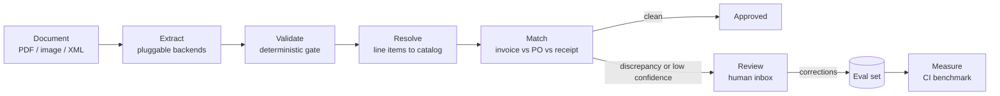

# docmatch

**Document reconciliation engine.** docmatch extracts invoices and receipts with vision language models, validates them with deterministic gates, matches them against purchase orders and receiving records, routes exceptions to human review, and measures every change against a labeled benchmark in CI.

> **Status:** phase 0, harness. Nothing is usable yet. The benchmark tables below fill in as phases complete. A phase is not done until its number is here.

## Why

Accounts-payable teams still receive most invoices as PDFs, scans, and phone photos. Turning those into ledger entries is three separate problems that most tools blur together:

1. **Extraction.** Reading header fields and line items out of noisy documents.
2. **Reconciliation.** Checking what was invoiced against what was ordered and what was received, the classic three-way match, and explaining every discrepancy.
3. **Trust.** Deciding per document whether to auto-approve or send to a human, and knowing when a prompt, model, or threshold change made things worse.

Most public projects stop at problem 1 with a single model call. docmatch treats problem 1 as a replaceable backend and puts the engineering into problems 2 and 3.

## What docmatch is not

- **Not an OCR wrapper.** Extraction backends are pluggable and benchmarked against each other. None of them is the product.
- **Not an autonomous agent.** The pipeline is an explicit state machine. Models structure text; deterministic code does the arithmetic and makes the decisions.
- **Not a SaaS.** No accounts, billing, or tenancy. One CLI, one API, one review page.

## Architecture



Every stage records cost and latency to a tracing backend, and every stage has an eval that runs in CI.

## Phases

Phases have exit criteria, not dates. Each phase produces a number that goes into the Benchmarks section. The next phase does not start until that number exists.

### Phase 0. Harness

Measurement before modeling.

- Loader for the DocILE dataset. Access is a request form that returns a download token; the data is never committed, only the loader and the results.
- Ground-truth normalization: currency, dates, numeric formats, whitespace.
- Metrics module: field-level precision, recall, and F1 with normalization; line-item scoring by optimal assignment between predicted and labeled rows, with per-cell accuracy.
- Fixed evaluation subset with a pinned manifest so numbers are comparable across commits.
- pytest suite and a CI job that runs the eval on the fixed subset.
- Baseline run with one cheap vision model.

**The number:** baseline field F1 and line-item F1 on the fixed subset.
**Exit:** CI is green and the Benchmarks section has one row.

### Phase 1. Extraction

- Pydantic schemas where every field carries a value and a confidence, and absence is explicit rather than guessed.
- An `Extractor` interface with several backends: a cheap vision model, a second provider, a commercial prebuilt invoice model, an OCR-then-LLM path, and a local open-weight document model. See Extraction backends.
- Image preprocessing: orientation from metadata, downscale to a fixed long edge, no grayscale.
- Deterministic validation gate: line totals reconcile to subtotal, tax arithmetic is consistent, totals agree, dates are sane, identifiers pass checksums where they exist. Confidence never gates acceptance on its own.
- Bounded retries with per-document cost accounting.

**The number:** a backend comparison table with field F1, line-item F1, gate pass rate, cost per document, and p50/p95 latency. A calibration table showing accuracy by confidence bucket. A gate ablation showing what the gate catches that confidence does not.
**Exit:** at least three backends in the table.

### Phase 2. Matching

- Generator that derives purchase orders and receiving records from the labeled invoices and injects labeled discrepancies: price variance, quantity short-ship and over-ship, missing line, extra line, unit-of-measure variant, tax mismatch, duplicate invoice, rounding drift.
- Rules engine with configurable tolerances and a discrepancy taxonomy with severities.
- Explainable results: which rule fired, on which numbers, with the tolerance applied.

**The number:** discrepancy detection precision and recall per type, and the false-positive rate on clean cases. An end-to-end row, image to match result, showing compound error.
**Exit:** per-type table plus the end-to-end row.

### Phase 3. Entity resolution

- Synthetic product catalog with SKUs, canonical descriptions, and noisy variants derived from labeled line items.
- Postgres with `pgvector` and `pg_trgm`. Hybrid retrieval with reciprocal rank fusion.
- Cross-encoder reranking as an ablation, kept or dropped based on the number.
- Resolution confidence feeds the review routing.

**The number:** top-1 and top-5 accuracy for trigram only, vector only, hybrid, and hybrid plus rerank, with latency per query.
**Exit:** the table, and a documented keep-or-drop decision on the reranker.

### Phase 4. Pipeline, review, observability

- Explicit status state machine in Postgres: received, extracted, validated, resolved, matched, needs_review, approved, rejected.
- Postgres-backed worker with idempotent handlers under at-least-once delivery.
- HTTP API in front of the engine.
- Tracing with cost and latency per stage.
- Review inbox: document viewer, extracted fields with confidence, discrepancy list, approve or correct. Corrections are appended to the eval set as new cases.
- A written decision on whether a graph orchestration library earns its place for pause-and-resume, or why plain code is enough.

**The number:** end-to-end p95 latency and cost per document; review rate as a function of gate strictness; a CI regression gate that fails when F1 drops beyond a threshold.
**Exit:** the full loop works from upload to approval on the fixed subset.

### Phase 5. Packaging

- Final benchmark tables, ablations, and a failure analysis of the top error classes.
- Reproducible eval entry point so anyone can regenerate a row.
- Short demo recording focused on reliability, not UI.

**The number:** this README.
**Exit:** a reader unfamiliar with the project can reproduce one benchmark row from a clean checkout.

### Phase 6. Regional adapters

The core is region-neutral. Adapters plug into three seams: `SourceAdapter` for ingestion, `RulesAdapter` for fiscal validation, and `ExportAdapter` for reporting formats.

First target, Dominican Republic:

- Structured e-invoice ingestion, e-CF XML, types E31, E32, E41, E43 first.
- Paper comprobantes through the same extraction seam.
- Checksum and registry validation for RNC and NCF identifiers.
- Fiscal rules: ITBIS 18%, ISR retention on services 15%, legal tip 10%.
- Pipe-delimited 606 purchase report export.
- A private regional benchmark that is never committed.

**The number:** field F1 on the private regional set, and a 606 export that passes the tax authority's pre-validator.

### Stretch

- Expose `extract`, `match`, and `explain` as an MCP server.

## Benchmarks

Filled in as phases complete. Every row names the commit that produced it.

### Extraction, fixed subset

| Backend | Field F1 | Line-item F1 | Gate pass rate | Cost / doc | p50 / p95 latency | Commit |
|---|---|---|---|---|---|---|
| | | | | | | |

### Matching, injected discrepancies

| Discrepancy type | Precision | Recall | Commit |
|---|---|---|---|
| | | | |

### Entity resolution

| Method | Top-1 | Top-5 | Latency / query | Commit |
|---|---|---|---|---|
| | | | | |

### End to end

| Stage | p95 latency | Cost / doc | Review rate | Commit |
|---|---|---|---|---|
| | | | | |

## Data

- **Real invoices:** DocILE, 6,680 real annotated invoices with key-field and line-item labels, plus 100k synthetic and close to 1M unlabeled documents. Access is a request form that returns a download token. The terms are non-commercial research use only, no redistribution, no third-party access, GDPR compliance, and deletion when the permission ends. They restrict the data, not the publication of results, so the numbers in this README are publishable and the documents are not.
- **Purchase orders, receiving records, catalog:** generated from the labels with controlled, labeled perturbations, so every discrepancy case has an exact expected answer. The generator and its seed are committed; the outputs are reproducible.
- **Regional private sets:** real documents with personal data. Never committed. Only aggregate numbers appear in this README.
- **Corrections from review:** appended to the eval set as new cases, forming the data flywheel.

**Getting DocILE.** Request a token at https://docile.rossum.ai/. The form returns it immediately; there is no approval wait. Put it in `.env` as `DOCILE_TOKEN` (see `.env.example`), then download the annotated subset, 1.14 GB, into the gitignored `data/`:

```bash
curl -O "https://docile-dataset-rossum.s3.eu-west-1.amazonaws.com/$DOCILE_TOKEN/annotated-trainval.zip"
```

Upstream's `download_dataset.sh` does the same thing. Note that its `--help` names this subset `labeled-trainval`, which 404s; `annotated-trainval` is the working name.

## Running the engine

From a clean checkout, with [uv](https://docs.astral.sh/uv/) installed:

```bash
uv sync            # create the virtualenv, install the engine and its dev tools
uv run ruff check  # lint
uv run pytest      # tests; these need no dataset and are what CI runs
```

With DocILE downloaded into `data/docile`, print the labels the dataset holds
for one document, its KILE header fields and its LIR line items:

```bash
uv run docmatch show <document-id>
```

Document ids are the entries of `data/docile/trainval.json`. Pass `--data-dir`,
or set `DOCMATCH_DATA_DIR`, to read a dataset kept outside the repository.

## Extraction backends

The `Extractor` interface is the seam. Backends are compared, not chosen up front. List prices as published by vendors at the time of writing; verify before relying on them.

| Backend | Kind | List price | Role in the benchmark |
|---|---|---|---|
| Gemini Flash-tier with structured output | vision LLM | fractions of a cent per page | cheap default |
| Claude Haiku 4.5 or Sonnet 5 with structured output | vision LLM | $1 and $2 input per million tokens respectively | second provider |
| Azure Document Intelligence prebuilt-invoice | specialized document model | $10 per 1,000 pages, free tier available | commercial baseline |
| Google Document AI Invoice Parser | specialized document model | $10 per 1,000 pages | commercial baseline, optional |
| Cloud Vision document OCR, then an LLM over the text | OCR-first | $1.50 per 1,000 pages, free tier available | ablation: what layout loss costs |
| Docling with granite-docling-258M, local | open-weight document model | free, CPU | open-source baseline, strong on PDF tables |

## Stack

| Layer | Choice | Why |
|---|---|---|
| Engine | Python 3.12, `uv`, Pydantic | The language of the ecosystem the engine talks to. |
| Structured output | Provider-native constrained decoding, Pydantic schemas | Every major provider guarantees schema conformance; no DSL needed. |
| Storage and retrieval | Postgres, `pgvector`, `pg_trgm` | One ACID store for records, vectors, and fuzzy text. Trigram similarity fits short SKU strings; it is not BM25 and is not called that here. |
| Queue | Postgres-backed worker | No second datastore for a single-node system. |
| API | FastAPI | Thin, typed, boring. |
| Tracing | Langfuse | Open source, self-hostable, per-stage cost and latency. |
| Evals | pytest plus a metrics module | Ground-truth extraction needs field-level and assignment metrics, not judge models. |
| Review UI | Next.js, TypeScript | One page, timeboxed. |

Deliberately cut: schema DSLs, document-parsing SaaS as a foundation, Celery and Redis, judge-model eval frameworks, graph orchestration until phase 4 proves the need.

## Definition of done

A phase is done when its number is in this README with the commit that produced it, the eval that produced it runs in CI, and the next phase can start from a clean checkout.

## Repository layout

```text
docmatch/
  pyproject.toml       uv workspace root: dev tooling, lint and test configuration
  uv.lock              pinned for every machine and for CI
  engine/              the Python engine, a uv workspace member
    pyproject.toml     the docmatch package and its `docmatch` command
    src/docmatch/      extraction, validation, resolution, matching, evals
  apps/review/         Next.js review inbox, from phase 4
  data/                ignored: datasets, generated fixtures, private sets
  docs/                decision records
  .github/workflows/   CI: ruff and pytest on every push
```

Tests live next to the code they test, so `src/docmatch/docile/dataset.py` is
tested by `src/docmatch/docile/test_dataset.py`. The eval suite will live under
`engine/tests/evals`.

## Contributing

Early days. Open an issue before a pull request so the phase plan stays intact.

## License

Apache-2.0. See [LICENSE](LICENSE).
